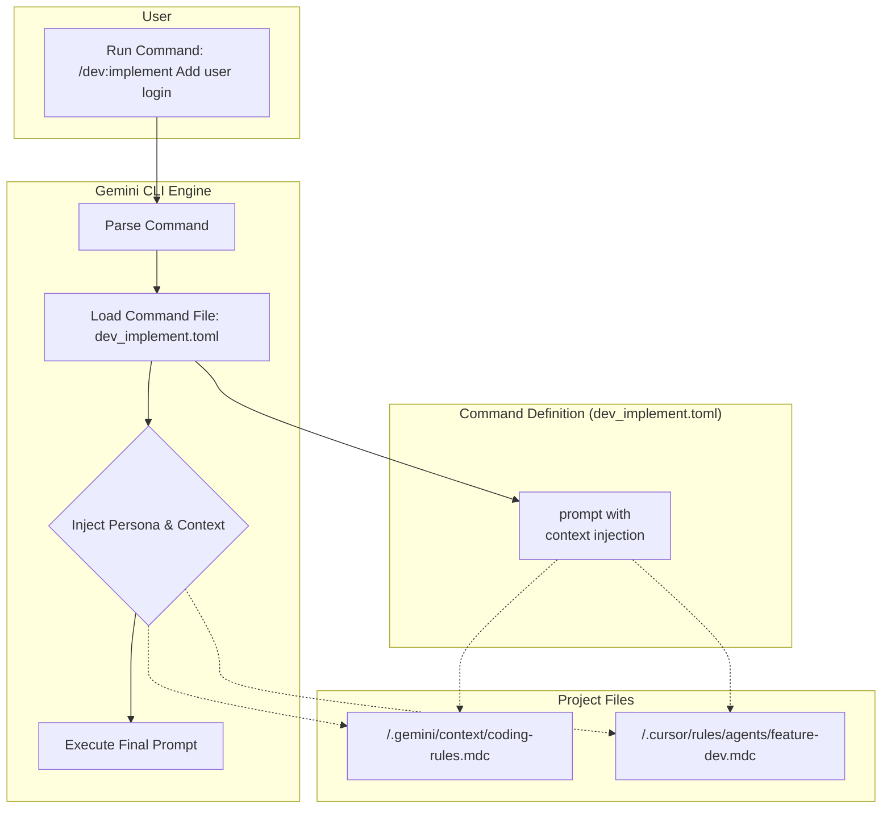
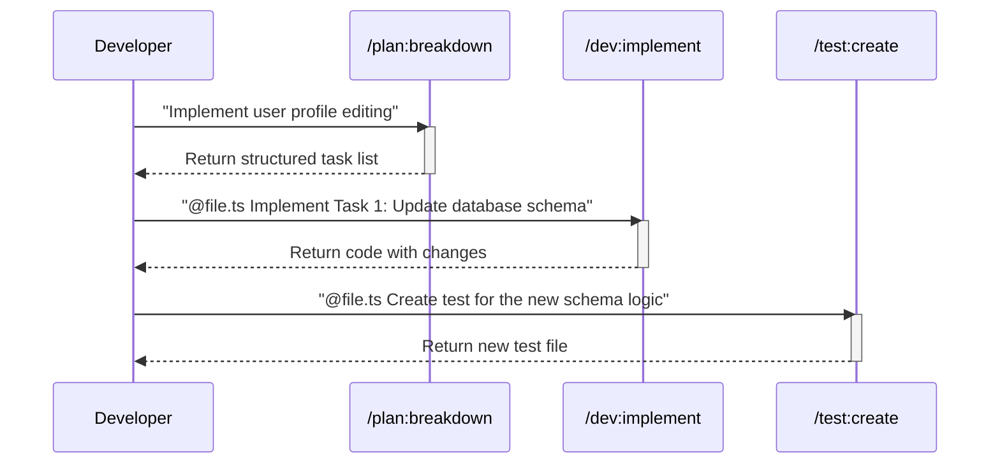

# Gemini CLI Workflow Engine: The Command-Line Powerhouse

**Transform your development process from a series of manual steps into a powerful, orchestrated, and repeatable workflow, all from your command line.**

This document outlines the vision, strategy, and implementation plan for converting our project's agentic workflow into a suite of intelligent Gemini CLI commands.

## 📖 **Quick Navigation**

- **[The Vision](#-the-vision-from-manual-process-to-workflow-engine)**: Why this is a leap forward for AI-assisted development.
- **[How It Works](#-how-it-works-the-composable-command-system)**: A visual breakdown of the command architecture.
- **[Workflow in Action](#-workflow-in-action-a-real-world-scenario)**: A step-by-step example of the commands in use.
- **[Implementation Plan](#-implementation-plan-epics--stories)**: The detailed roadmap for building this system.

---

## 🚀 **The Vision: An Execution Layer for Your Agentic Workflow**

Our project already has a sophisticated **agentic workflow**, defined in `agents.md` and the `.cursor/rules/` directory. This system is the "brain" of our operation, containing the personas, protocols, and core logic for our AI development team.

However, using this system requires a developer to manually assemble context, which is slow and inconsistent.

**The Gemini CLI Workflow Engine is the "hands" for this "brain."**

We are building an **executable layer** on top of our existing agentic system. These custom commands are not a new workflow; they are a powerful interface to the one we already have. Instead of telling an AI *how* to do its job, you will use a simple command to tell it *what* to do, and the command will automatically assemble the correct persona and context from our established system.

### **The Power of This Approach: Leverage, Don't Replace**

This model is superior because it enhances our existing investment, providing compounding returns on the detailed agent personas and protocols we have already built.

| Aspect | Standard Gemini CLI | **CLI Workflow Engine** |
| :--- | :--- | :--- |
| **Workflow** | Ad-hoc and user-dependent | **Systematized & Enforced** by existing `agents.md` protocols. |
| **Context** | Manual, repetitive, and error-prone | **Automated & Surgical**, pulled directly from `.cursor/` rules. |
| **Consistency** | Relies on developer memory | **Guaranteed by Design**, as commands inject the same persona every time. |
| **Efficiency** | High cognitive load (What persona? What rules?) | **Streamlined & Effortless** (e.g., `/dev:implement`). |
| **Onboarding** | Requires deep study of the entire agentic system | **Guided by Commands**, lowering the barrier to entry. |

---

## 🔧 **How It Works: The Composable Command System**

The system is built on a foundation of **composable, task-oriented commands**. Instead of monolithic commands, we have a suite of focused tools that can be chained together to orchestrate complex workflows.

### **Core Architecture**

The magic lies in how commands assemble their own context before execution.

1.  **User runs a command** (e.g., `/dev:implement`).
2.  The CLI loads the corresponding **TOML file**.
3.  The prompt within the file uses `!{...}` to **inject the necessary context**:
    - The correct **Agent Persona** (e.g., `feature-dev.mdc`).
    - The relevant **Rule Snippets** (e.g., `coding-rules.mdc`).
4.  The final, context-rich prompt is sent to the model for execution.

---

## 🤖 **Workflow in Action: A Real-World Scenario**

Imagine you need to implement a new feature from the backlog. Here’s how you would use the command suite.

-   **Step 1: Planning.** The developer uses `/plan:breakdown` to get a clear, actionable task list from the System Architect persona.
-   **Step 2: Implementation.** For each task, they open the relevant file and use `/dev:implement`, which automatically uses the Feature Developer persona and injects the project's coding standards.
-   **Step 3: Testing.** Once the code is written, they use `/test:create` to generate a high-quality integration test, guided by the QA Lead persona and our mandatory testing patterns.

---

## 🗺️ **Implementation Plan: Epics & Stories**

This project is broken down into three thematic epics. The plan is designed to deliver high-value tools early and build towards a fully orchestrated workflow.

### **Epic 1: Foundational Tooling & Analysis**

*Goal: Establish the core command structure and deliver an immediate, high-value analysis tool that leverages Gemini's core strengths.*

-   **Story 1.1: Initialize Command Directory**: Create the `/.gemini/commands/` directory with subdirectories for namespacing (`/plan`, `/dev`, `/test`, `/docs`, `/git`).
-   **Story 1.2: Distill Critical Context Snippets**: Create focused `.mdc` files in `/.gemini/context/` containing essential rules (e.g., `coding-rules.mdc`, `testing-patterns.mdc`) to ensure prompts are lean and precise.
-   **Story 1.3 (High-Value First): Implement `/dev:analyze`**: Create the "Pre-Flight Check" command. This command will act as the **Context Specialist**, analyzing a given file or directory to identify existing patterns, potential refactoring opportunities, and documentation gaps. This provides immediate value to developers before they write any code.

### **Epic 2: Core Agent Execution Commands**

*Goal: Build the primary "doer" commands that encapsulate the core agent personas and automate the main development tasks.*

-   **Story 2.1: Implement `/plan:breakdown`**: The "System Architect" command. It takes a high-level feature request and decomposes it into a structured, actionable plan, referencing the `system-architect.mdc` persona.
-   **Story 2.2: Implement `/dev:implement`**: The "Feature Developer" command. It takes a specific task from the plan and generates the production code, injecting the `feature-dev.mdc` persona and relevant coding rules.
-   **Story 2.3: Implement `/test:create`**: The "QA Lead" command. It generates high-quality, real API tests for a given piece of code, guided by the `testing-patterns.mdc` snippet.
-   **Story 2.4: Implement `/git:commit`**: The "Smart Commit" command. It uses `!{git diff --staged}` to analyze changes and generate a Conventional Commit message. It will be enhanced to accept arguments for influencing the commit style (e.g., `feat`, `fix`, `chore`).

### **Epic 3: Workflow Orchestration & Validation**

*Goal: Move beyond individual tasks to managing the end-to-end workflow, including backlog management and automated validation.*

-   **Story 3.1: Implement `/plan:create-ticket`**: The "Backlog Assistant" command. This command will take the output from `/plan:breakdown` and format it into a perfect, ready-to-paste ticket for `PROJECT_BACKLOG.md`, automating a key part of the System Architect's process.
-   **Story 3.2: Implement `/docs:validate`**: The "Interactive Validator" command. This tool will run `npm run validate:docs`, capture the output, and if errors are found, it will use its intelligence to analyze the errors and suggest the specific code or documentation changes needed to fix them.
-   **Story 3.3: Implement `/workflow:help`**: A dynamic help command that explains how to use the entire command suite, providing examples of how to chain commands together for common scenarios (e.g., `plan -> implement -> test -> commit`).
-   **Story 3.4: Finalize and Document the Suite**: Officially integrate the CLI Workflow Engine into our standard processes by updating `DEVELOPMENT.md` and ensuring all command descriptions are complete.