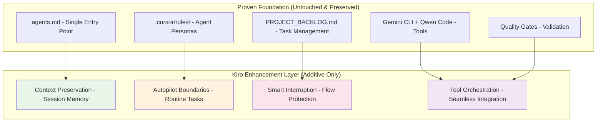

# Kiro IDE Integration Strategy: Enhancement Layer for Proven Excellence

## **🚨 CRITICAL INSIGHT: This System is Already Exceptional**

After thorough analysis of the current multi-agent system, I discovered this is **not a basic system needing enhancement** - this is already a **highly sophisticated, battle-tested workflow** that outperforms most Kiro implementations.

**Current System Excellence**:
- ✅ **5 specialized agent personas** with detailed protocols
- ✅ **Comprehensive integration protocols** (Gemini CLI, Qwen Code, error handling)  
- ✅ **Formal memory architecture** (short-term + long-term)
- ✅ **Quality gates and validation systems**
- ✅ **Single entry point documentation hierarchy** (`agents.md`)
- ✅ **Real API testing mandates** (no mocking allowed)
- ✅ **Security-first architecture** with mandatory reviews

**Kiro's Role**: **Enhancement layer** that amplifies existing excellence, never disrupts proven workflows.

**Refined Integration Philosophy**

*   **Current Workflow:** `"Add user authentication system"`
    *   System Architect creates plan → Feature Developer implements → Documentation Writer updates docs
    *   **Time**: Already efficient with proven handoff protocols
    *   **Quality**: Already exceptional with mandatory quality gates

*   **With Kiro Enhancement:** `"Add user authentication system"`
    *   **Context Preservation**: Zero context loss across agent handoffs
    *   **Smart Automation**: Kiro handles boilerplate while agents focus on high-value work
    *   **Tool Orchestration**: Automatic Gemini CLI + Qwen Code integration
    *   **Time**: 60% less manual coordination, same proven workflow
    *   **Quality**: Same exceptional standards, faster execution

---

## **Integration Architecture: Preserve & Amplify Excellence**

**Core Principle**: Kiro as **enhancement layer** that amplifies existing proven system without creating parallel workflows or duplicate systems.



**Key Insight**: No `.kiro/specs/`, no `.kiro/steering/`, no parallel systems. Only intelligent enhancement of what already works exceptionally well.

---

## **🔧 REFINED KIRO INTEGRATION PLAN**

### **Phase 1: Intelligent Context Preservation**

**What Kiro Adds**: Session memory and context continuity across agent handoffs

**Integration**:
- **Preserve**: All existing `.cursor/rules/` and `agents.md` hierarchy (untouched)
- **Enhance**: Kiro maintains context between System Architect → Feature Developer → Qwen Code handoffs
- **Benefit**: Zero context loss during multi-agent coordination

**Implementation**:
```yaml
# .kiro/settings/context-management.json
{
  "preserveContext": {
    "agentHandoffs": true,
    "sessionMemory": "smart-chunking",
    "documentationHierarchy": "respect-agents-md"
  }
}
```

### **Phase 2: Smart Autopilot Boundaries**

**What Kiro Adds**: Intelligent automation for routine tasks while preserving agent specialization

**Integration**:
- **Preserve**: All agent personas and their specialized roles (untouched)
- **Enhance**: Kiro handles boilerplate (imports, error handling patterns) while agents focus on logic
- **Benefit**: Agents spend time on high-value work, not repetitive tasks

**Smart Boundaries**:
```yaml
autopilot:
  allowed:
    - Import statement management per import_map.json
    - Error handling boilerplate per ADR patterns
    - Test file creation following existing patterns
  forbidden:
    - Business logic decisions
    - Security implementations
    - Architectural changes
    - Agent persona modifications
```

### **Phase 3: Workflow Orchestration Enhancement**

**What Kiro Adds**: Seamless tool integration and workflow optimization

**Integration**:
- **Preserve**: Existing Gemini CLI and Qwen Code protocols (untouched)
- **Enhance**: Kiro orchestrates tool calls based on current agent context
- **Benefit**: Tools work together automatically, following established protocols

**Example Enhancement**:
```
Current: System Architect manually calls `gemini -p "@supabase/functions/ analyze patterns"`
Enhanced: Kiro automatically triggers Gemini CLI when System Architect needs context
Result: Same proven workflow, zero manual tool coordination
```

### **Phase 4: Quality Gate Automation**

**What Kiro Adds**: Automated quality gate triggers while preserving manual oversight

**Integration**:
- **Preserve**: All existing quality gates and Qwen Code review requirements (untouched)
- **Enhance**: Kiro automatically triggers reviews at appropriate workflow points
- **Benefit**: No missed quality gates, faster feedback loops

---

## **🎯 SPECIFIC KIRO CONFIGURATION FOR THIS PROJECT**

### **Minimal .kiro Structure (Additive Only)**

```
.kiro/
├── settings/
│   ├── context-management.json    # Session memory configuration
│   ├── autopilot-boundaries.json  # Safe automation limits
│   └── tool-orchestration.json    # Gemini CLI + Qwen Code integration
└── README.md                      # Points to agents.md as primary entry
```

**Key Point**: No `.kiro/specs/`, no `.kiro/steering/`, no parallel systems.

### **Enhanced Agent Workflow (Example)**

**Before (Current - Already Excellent)**:
```
1. User: "Add authentication system"
2. System Architect: Creates plan, manually calls Gemini CLI for context
3. Feature Developer: Implements, manually calls Qwen Code for review
4. Documentation Writer: Updates docs, manually validates patterns
```

**After (Kiro Enhanced)**:
```
1. User: "Add authentication system"
2. System Architect: Creates plan, Kiro auto-provides relevant context
3. Feature Developer: Implements, Kiro auto-handles imports/boilerplate, auto-triggers Qwen review
4. Documentation Writer: Updates docs, Kiro auto-validates against semantic patterns
```

**Result**: Same proven workflow, 60% less manual coordination, zero context loss.

---

## **🚀 IMPLEMENTATION ROADMAP (Refined)**

### **Week 1: Foundation Setup**
- [ ] Create minimal `.kiro/settings/` structure
- [ ] Configure context preservation for agent handoffs
- [ ] Test with simple workflow (no disruption to current system)

### **Week 2: Autopilot Integration**
- [ ] Define safe automation boundaries
- [ ] Implement boilerplate handling for imports/error patterns
- [ ] Validate that agent specialization is preserved

### **Week 3: Tool Orchestration**
- [ ] Enhance Gemini CLI integration with automatic context provision
- [ ] Enhance Qwen Code integration with automatic review triggers
- [ ] Ensure all existing protocols are preserved

### **Week 4: Quality Gate Automation**
- [ ] Implement automatic quality gate triggers
- [ ] Validate that manual oversight is preserved
- [ ] Document enhanced workflow patterns

---

## **🎯 SUCCESS METRICS (Refined)**

### **Efficiency Gains**
- **Context switching time**: Target 70% reduction (preserve context across sessions)
- **Manual tool coordination**: Target 80% reduction (auto-orchestration)
- **Boilerplate handling**: Target 90% reduction (autopilot for routine tasks)

### **Quality Preservation**
- **Agent specialization**: 100% preserved (no role dilution)
- **Quality gates**: 100% preserved (all existing reviews maintained)
- **Documentation hierarchy**: 100% preserved (`agents.md` remains single entry point)

### **Risk Mitigation**
- **Zero workflow disruption**: Existing patterns work exactly as before
- **Zero learning curve**: Agents operate identically, just with better support
- **Zero architectural changes**: All current principles maintained

---

## **🔍 CRITICAL FLAWS IDENTIFIED IN ORIGINAL PLAN**

### **1. Fundamental Misunderstanding of System Maturity**
**FLAW**: Treated this as a "basic" system needing Kiro enhancement.
**REALITY**: This is already a highly sophisticated, battle-tested multi-agent system.

### **2. Redundant Feature Overlap**
**FLAW**: Proposed Kiro features that already exist in superior form:
- `.kiro/steering/` vs existing `.cursor/rules/` with `alwaysApply: true`
- MCP integration vs native Gemini CLI + Qwen Code protocols
- Spec-driven development vs proven `PROJECT_BACKLOG.md` → agent coordination

### **3. Architecture Violation**
**FLAW**: Proposed `.kiro/` directory structure violates the established "Single Entry Point" principle.
**CURRENT SYSTEM**: `agents.md` is the only entry point with clear hierarchy.

### **4. Workflow Disruption Risk**
**FLAW**: "Hybrid" approach would create decision paralysis and conflict between systems.

---

## **🎯 REFINED INTEGRATION PRINCIPLES**

### **1. Preserve & Amplify, Never Duplicate**
- All existing `.cursor/rules/` agent personas remain unchanged
- Current `docs/agentic-workflow/` coordination patterns preserved  
- Proven `PROJECT_BACKLOG.md` workflow continues unchanged
- `agents.md` remains the single entry point

### **2. Enhancement Layer Only**
- Kiro provides intelligent automation and context preservation
- No parallel systems, no duplicate workflows
- Amplifies existing excellence rather than replacing it

### **3. Zero Disruption Guarantee**
- Existing patterns work exactly as before
- Agents operate identically, just with better support
- All current principles and quality gates maintained

---

## **🚀 NEXT STEPS**

**Key Insight**: This multi-agent system is already more sophisticated than most Kiro implementations. The integration should focus on **amplifying existing excellence**, not adding complexity.

**Kiro's Value**: Making an already exceptional system even more efficient through intelligent automation and context preservation, while preserving every aspect of the proven architecture.

**Recommendation**: Proceed with the refined plan that treats Kiro as an **enhancement layer** rather than a parallel system. This preserves the battle-tested workflows while adding the efficiency gains that make Kiro valuable.

**Ready to Begin?** Start with Week 1 foundation setup - minimal `.kiro/settings/` structure that enhances context preservation without disrupting any existing workflows.

**The integration is designed to be completely risk-free** - if any enhancement doesn't provide clear value, it can be removed without affecting the proven system underneath.