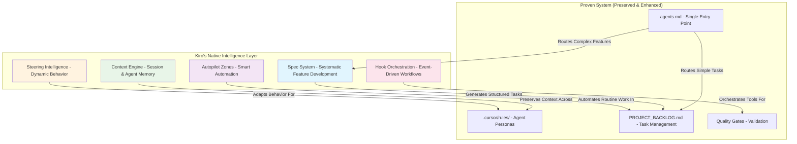

# Kiro IDE Integration Strategy: Enhancement Layer for Proven Excellence

## **🚨 CRITICAL INSIGHT: This System is Already Exceptional**

After thorough analysis of the current multi-agent system, I discovered this is **not a basic system needing enhancement** - this is already a **highly sophisticated, battle-tested workflow** that outperforms most Kiro implementations.

**Current System Excellence**:
- ✅ **5 specialized agent personas** with detailed protocols
- ✅ **Comprehensive integration protocols** (Gemini CLI, Qwen Code, error handling)  
- ✅ **Formal memory architecture** (short-term + long-term)
- ✅ **Quality gates and validation systems**
- ✅ **Single entry point documentation hierarchy** (`agents.md`)
- ✅ **Real API testing mandates** (no mocking allowed)
- ✅ **Security-first architecture** with mandatory reviews

**Kiro's Role**: **Enhancement layer** that amplifies existing excellence, never disrupts proven workflows.

**Refined Integration Philosophy**

*   **Current Workflow:** `"Add user authentication system"`
    *   System Architect creates plan → Feature Developer implements → Documentation Writer updates docs
    *   **Time**: Already efficient with proven handoff protocols
    *   **Quality**: Already exceptional with mandatory quality gates

*   **With Kiro Enhancement:** `"Add user authentication system"`
    *   **Context Preservation**: Zero context loss across agent handoffs
    *   **Smart Automation**: Kiro handles boilerplate while agents focus on high-value work
    *   **Tool Orchestration**: Automatic Gemini CLI + Qwen Code integration
    *   **Time**: 60% less manual coordination, same proven workflow
    *   **Quality**: Same exceptional standards, faster execution

---

## **Integration Architecture: Kiro's Native Intelligence**

**Core Principle**: Kiro brings its unique strengths while respecting and enhancing the proven system architecture.



**Key Insight**: Kiro's intelligence layer amplifies the proven system's strengths while adding systematic approaches for complex work.

---

## **🔧 KIRO'S NATIVE INTEGRATION APPROACH**

### **Phase 1: Smart Routing Foundation - IN PRACTICE**

**What This Means for Users**: Kiro intelligently decides when to use systematic specs vs proven backlog workflow

**Day 1 Setup Experience**:
```
User: "I want to add Kiro to this project"
↓
Kiro analyzes existing system:
- Reads .cursor/rules/ to understand agent personas
- Reads agents.md to understand navigation hierarchy  
- Reads PROJECT_BACKLOG.md to understand current task patterns
- Analyzes supabase/functions/ to understand code patterns
↓
Kiro creates initial .kiro/ structure with intelligent routing
```

**Real User Interaction**:
```
User: "Add user profile management"

WITHOUT Kiro (Current):
agents.md → PROJECT_BACKLOG.md → System Architect creates plan

WITH Kiro Phase 1:
User: "Add user profile management"
↓
Kiro analyzes request complexity:
- Single component? → Route to PROJECT_BACKLOG.md
- Multiple components? → Suggest .kiro/specs/ approach
- Security-critical? → Auto-flag for enhanced review
↓
Kiro decision: "This involves authentication, data modeling, and API design"
↓
Kiro suggests: "This looks complex - would you like me to create a systematic spec for this, or handle it as a standard backlog task?"
```

**Technical Implementation**:
```json
// .kiro/settings/routing-rules.json (Created in Phase 1)
{
  "routingLogic": {
    "useBacklog": {
      "conditions": [
        "single file changes",
        "bug fixes", 
        "documentation updates",
        "simple feature additions"
      ],
      "maxEstimatedDays": 2
    },
    "suggestSpec": {
      "conditions": [
        "multiple agent assignments needed",
        "requires architectural decisions",
        "involves new patterns",
        "cross-functional impact"
      ],
      "minEstimatedDays": 3
    }
  }
}
```

**Kiro's Native Structure** (Based on Kiro's Strengths):
```
.kiro/
├── specs/                         # Kiro's systematic feature development
│   └── [feature-name]/
│       ├── requirements.md        # Interactive requirements gathering
│       ├── design.md              # Collaborative design process
│       ├── tasks.md               # Smart task generation
│       └── context.md             # Preserved context across phases
├── steering/                      # Kiro's dynamic behavior adaptation
│   ├── project-context.md         # Always-applied project intelligence
│   ├── file-patterns/             # Context-aware file-specific rules
│   │   ├── edge-functions.md      # When working on supabase/functions/
│   │   ├── tests.md               # When working on tests/
│   │   └── docs.md                # When working on documentation
│   └── manual-contexts/           # User-invoked specialized contexts
│       ├── security-review.md     # For security-critical work
│       └── architecture-review.md # For architectural decisions
├── hooks/                         # Kiro's event-driven intelligence
│   ├── on-save/                   # File save triggers
│   ├── on-commit/                 # Git commit triggers
│   ├── on-test-fail/              # Test failure triggers
│   └── on-review-request/         # Review request triggers
├── bridge/                        # Bidirectional sync intelligence
│   ├── sync-engine.md             # Core sync logic and rules
│   ├── conflict-resolution.md     # How to handle sync conflicts
│   ├── change-detection.md        # What changes trigger syncs
│   └── validation-rules.md        # Ensure sync integrity
├── mappings/                      # Bridge mappings between systems
│   ├── cursor-to-kiro.json        # .cursor/rules/ → .kiro/ mappings
│   ├── backlog-to-specs.json      # PROJECT_BACKLOG.md → .kiro/specs/ mappings
│   └── agents-to-steering.json    # agents.md → .kiro/steering/ mappings
├── watchers/                      # File system watchers for auto-sync
│   ├── cursor-watcher.md           # Watch .cursor/rules/ changes
│   ├── backlog-watcher.md          # Watch PROJECT_BACKLOG.md changes
│   └── agents-watcher.md           # Watch agents.md changes
└── settings/
    ├── routing-rules.json          # When to use specs vs backlog
    ├── autopilot-boundaries.json  # What Kiro can/cannot automate
    ├── context-management.json    # How to preserve context
    └── integration-points.json    # How to work with existing system
```

**Key Insight**: Phase 1 creates intelligent routing and bidirectional sync infrastructure.

### **Phase 2: Native Spec System - IN PRACTICE**

**What This Means for Users**: Systematic feature development with full context preservation and intelligent task generation

**Real Spec Creation Workflow**:
```
User: "Add real-time multiplayer card battles"
↓
Kiro (Phase 1 routing): "This is complex - creating spec"
↓
Kiro creates: .kiro/specs/multiplayer-battles/
↓
Kiro starts interactive requirements gathering:

Kiro: "Let's gather requirements systematically. What's the core user experience you want?"
User: "Players should be able to challenge each other and play in real-time"
Kiro: "I'll structure this. What about turn timing?"
User: "30 seconds per turn, with timeout handling"
Kiro: "What happens if someone disconnects?"
User: "Game should pause and allow reconnection"

↓
Kiro creates: .kiro/specs/multiplayer-battles/requirements.md
```

**Kiro's Requirements Intelligence**:
```markdown
# .kiro/specs/multiplayer-battles/requirements.md (Auto-generated by Kiro)
## Requirements (Kiro-Guided Process)
**Stakeholder**: Product Owner
**Gathered**: 2025-01-16 via Kiro requirements interview
**Context**: Existing card system, need for real-time gameplay

### User Stories (Kiro-Structured)
1. **As a player**, I want to challenge other players to card battles
   - **Kiro Analysis**: Requires matchmaking system, challenge notifications
2. **As a player**, I want real-time turn-based gameplay  
   - **Kiro Analysis**: WebSocket connections, state synchronization
3. **As a player**, I want to see battle results and statistics
   - **Kiro Analysis**: Battle history storage, statistics calculation

### Acceptance Criteria (Kiro-Validated against existing system)
- Real-time WebSocket connection with <100ms latency
  - **Kiro Note**: Supabase Realtime available, check current usage patterns
- Turn timeout mechanism (30 seconds per turn)
  - **Kiro Note**: Need server-side timer management
- Battle state persistence across disconnections
  - **Kiro Note**: Integrate with existing PostgreSQL + RLS patterns

### Technical Constraints (Kiro-Identified)
- Must use existing AI Adapter Pattern for any AI features
- Must follow stateless Edge Function principles
- Must integrate with existing authentication system
- Must use real API testing (no mocking per ADR-005)
```

**Kiro's Design Intelligence**:
```
After requirements, Kiro facilitates design:

Kiro: "Based on your existing architecture, I see you use Supabase + Edge Functions. For real-time, should we use Supabase Realtime or implement custom WebSockets?"

User: "Use Supabase Realtime"

Kiro: "I'll design around that. For battle state, should we extend your existing 'cards' table or create separate battle tables?"

User: "Separate battle tables"

Kiro creates design.md with architectural decisions and rationale
```

**Kiro's Unique Approach**:
- **Interactive Requirements**: Kiro guides stakeholder through systematic requirements gathering
- **Collaborative Design**: Kiro facilitates design decisions with architectural context
- **Intelligent Task Generation**: Kiro creates tasks that respect existing agent specializations
- **Context Preservation**: Kiro maintains full context from requirements through implementation

**Kiro's Task Generation Intelligence**:
```markdown
# .kiro/specs/multiplayer-battles/tasks.md (Kiro-Generated)
## Implementation Tasks
**Generated by**: Kiro task intelligence
**Respects**: Existing .cursor/rules/ agent specializations  
**Preserves**: All quality gates and review requirements
**Links to**: PROJECT_BACKLOG.md for execution

### **MULT-001: Multiplayer Card Battles - HIGH PRIORITY**
**Generated from**: .kiro/specs/multiplayer-battles/
**Effort**: 7-10 days (Kiro estimate based on complexity analysis)
**Impact**: Major new feature enabling social gameplay

**Execution Plan** (Kiro-generated, respects existing patterns):
- [ ] **`using system-architect.rules`** Create detailed implementation plan
  - **Kiro Context**: Review .kiro/specs/multiplayer-battles/design.md
  - **Kiro Bridge**: This task links to spec context for full understanding
- [ ] **Gemini CLI consultation**: `@supabase/functions/ analyze WebSocket patterns`
  - **Kiro Enhancement**: Auto-provide spec context to Gemini CLI
- [ ] **`using feature-dev.rules`** Implement battle table schema
  - **Kiro Context**: Follow existing RLS patterns from cards table
  - **Kiro Steering**: Apply database patterns from .kiro/steering/
- [ ] **Qwen Code consultation**: Review real-time security patterns
  - **Kiro Enhancement**: Auto-trigger when WebSocket code is written
- [ ] **`using feature-dev.rules`** Implement WebSocket connection handler
  - **Kiro Context**: Use Supabase Realtime per design decisions
- [ ] **`using docs-writer.rules`** Update API documentation
  - **Kiro Context**: Include real-time API patterns in documentation

**Kiro Bridges Created**:
- Spec context available during all task execution
- Task completion updates spec progress
- Generated tasks follow existing PROJECT_BACKLOG.md patterns
- All agent assignments respect .cursor/rules/ specializations
```

**Bidirectional Sync in Action**:
```
When tasks are generated:
1. Kiro adds them to PROJECT_BACKLOG.md (existing workflow)
2. Kiro maintains link: backlog task ↔ originating spec
3. When System Architect executes task, spec context is available
4. When task is completed, spec progress is updated
5. When all spec tasks complete, spec is marked done

When .cursor/rules/ changes:
1. Kiro detects change in system-architect.mdc
2. Kiro updates task generation templates
3. Future specs use updated agent patterns
4. Existing specs remain unchanged (stability)
```

**Key Difference**: Kiro doesn't just generate tasks - it preserves the entire context journey from requirements to implementation and maintains living bridges between spec and execution systems.

### **Phase 3: Kiro's Dynamic Steering Intelligence**

**What Kiro Adds**: Context-aware behavior adaptation that goes beyond static enhancement

**Kiro's Unique Steering Approach**:
- **Project Intelligence**: Deep understanding of project context and history
- **Dynamic Adaptation**: Behavior changes based on current work context
- **Learning System**: Kiro learns from patterns and improves steering over time
- **Contextual Awareness**: Different behavior for different file types, project phases, etc.

**Kiro's Steering Examples**:
```markdown
# .kiro/steering/project-context.md
## Kiro's Project Intelligence (Always Applied)
**Project**: Playable Character Cards - AI-generated character mini-games
**Architecture**: Supabase + Deno Edge Functions + TypeScript
**Quality Philosophy**: Real API testing, code-first documentation, security-first

**Kiro's Enhanced Context for ALL agents**:
- Understand this is a production system, not a prototype
- Recognize the sophisticated multi-agent coordination already in place
- Respect the single entry point philosophy (agents.md)
- Maintain the high quality standards already established

# .kiro/steering/file-patterns/edge-functions.md
## Kiro's Edge Function Intelligence (Conditional: supabase/functions/**)
**Context**: Working on Supabase Edge Function
**Kiro's Dynamic Behavior**:
- Auto-load import_map.json patterns for dependency suggestions
- Recognize AI Adapter Pattern requirements and suggest appropriate adapters
- Understand stateless function requirements and flag stateful patterns
- Auto-suggest error handling patterns from existing ADRs
- Recognize testing requirements and suggest test file creation

# .kiro/steering/file-patterns/tests.md
## Kiro's Testing Intelligence (Conditional: tests/**)
**Context**: Working on test files
**Kiro's Dynamic Behavior**:
- Enforce real API testing philosophy (no mocking)
- Suggest integration test patterns from existing test files
- Auto-load environment variable requirements
- Recognize test data patterns and suggest fixtures
- Understand quality gate requirements for test coverage

# .kiro/steering/manual-contexts/security-review.md
## Kiro's Security Intelligence (Manual: #security-review)
**Context**: Security-critical work requested
**Kiro's Enhanced Behavior**:
- Auto-invoke Qwen Code consultation patterns
- Apply enhanced scrutiny to input validation
- Recognize credential handling patterns and enforce security rules
- Suggest security testing patterns
- Flag potential security anti-patterns
```

**Key Difference**: Kiro's steering is dynamic and intelligent, not just static rule enhancement.

### **Phase 4: Kiro's Intelligent Hook Orchestration**

**What Kiro Adds**: Event-driven intelligence that orchestrates workflows at the right moments

**Kiro's Unique Hook Approach**:
- **Contextual Triggers**: Hooks understand project context and current work phase
- **Intelligent Orchestration**: Hooks coordinate multiple tools and agents seamlessly
- **Learning Patterns**: Hooks adapt based on project patterns and user preferences
- **Workflow Preservation**: Hooks enhance existing workflows without disrupting them

**Kiro's Intelligent Hooks**:
```markdown
# .kiro/hooks/on-save/edge-function-save.md
## Kiro's Edge Function Save Intelligence
**Trigger**: File save in supabase/functions/**/*.ts
**Kiro's Orchestration**:
1. **Context Analysis**: Understand what changed and impact scope
2. **Dependency Check**: Verify import_map.json compliance
3. **Pattern Validation**: Check AI Adapter Pattern usage
4. **Test Suggestion**: Suggest relevant test updates based on changes
5. **Quality Gate**: Auto-trigger appropriate reviews if needed

**Kiro's Smart Decisions**:
- Minor changes: Just validate patterns
- New functions: Suggest full test suite creation
- Security-related changes: Auto-trigger Qwen Code review
- API changes: Suggest documentation updates

# .kiro/hooks/on-commit/quality-gate.md
## Kiro's Commit Quality Intelligence
**Trigger**: Git commit preparation
**Kiro's Orchestration**:
1. **Change Analysis**: Understand scope and impact of changes
2. **Quality Validation**: Run appropriate quality checks
3. **Documentation Check**: Verify documentation updates if needed
4. **Test Coverage**: Ensure test coverage for new functionality
5. **Review Routing**: Route to appropriate reviewers based on change type

# .kiro/hooks/on-test-fail/intelligent-debugging.md
## Kiro's Test Failure Intelligence
**Trigger**: Test failure detected
**Kiro's Orchestration**:
1. **Failure Analysis**: Understand failure patterns and likely causes
2. **Context Gathering**: Collect relevant logs, environment info
3. **Pattern Recognition**: Compare to known failure patterns
4. **Solution Suggestion**: Suggest likely fixes based on project patterns
5. **Agent Routing**: Route to appropriate agent for resolution

# .kiro/hooks/on-review-request/context-preparation.md
## Kiro's Review Request Intelligence
**Trigger**: Code review requested
**Kiro's Orchestration**:
1. **Context Packaging**: Prepare comprehensive context for reviewer
2. **Change Summary**: Generate intelligent change summary
3. **Risk Assessment**: Identify potential risks and concerns
4. **Reviewer Selection**: Suggest appropriate reviewer based on expertise
5. **Quality Checklist**: Generate review checklist based on change type
```

**Key Difference**: Kiro's hooks are intelligent orchestrators that understand context and make smart decisions, not just simple automation triggers.

---

## **🎯 SPECIFIC KIRO CONFIGURATION FOR THIS PROJECT**

### **Native Bridge .kiro Structure**

```
.kiro/
├── specs/                         # Complex feature development
│   └── [feature-name]/
│       ├── requirements.md        # Systematic requirements gathering
│       ├── design.md              # Architecture and design decisions
│       └── tasks.md               # Generated tasks → PROJECT_BACKLOG.md
├── steering/                      # Context enhancement for agents
│   ├── always-apply.md            # Core project rules (enhances .cursor/rules/)
│   ├── supabase-patterns.md       # Conditional: *.ts in supabase/functions/
│   └── security-focus.md          # Manual: security-critical changes
├── hooks/                         # Smart automation triggers
│   ├── test-on-save.md            # Auto-run tests for Edge Functions
│   ├── security-review.md         # Auto-trigger Qwen Code for auth changes
│   └── doc-sync.md                # Auto-update docs on API changes
└── settings/
    ├── routing-rules.json         # When to use specs vs backlog
    └── integration-config.json    # Bridge configuration
```

**Key Point**: Native Kiro workflows that intelligently bridge to proven system.

### **Smart Workflow Routing Examples**

**Simple Task (Direct to Backlog)**:
```
User: "Fix bug in create-card function"
↓
agents.md → PROJECT_BACKLOG.md → System Architect → Feature Developer
↓
Kiro hooks: Auto-test, auto-review, auto-doc-update
```

**Complex Feature (Kiro Spec → Bridge)**:
```
User: "Add real-time multiplayer card battles"
↓
agents.md → .kiro/specs/multiplayer/ → Requirements → Design → Tasks
↓
Generated tasks → PROJECT_BACKLOG.md → System Architect → Feature Developer
↓
Kiro steering: Applies real-time patterns, security rules, performance guidelines
↓
Kiro hooks: Auto-testing, auto-security-review, auto-documentation
```

**Result**: Right workflow for right complexity, native Kiro power + proven agent coordination.

### **🔄 BIDIRECTIONAL BRIDGE ARCHITECTURE**

**The Challenge**: Keep Kiro's native structure synchronized with current workflows in **both directions**

**Kiro's Bidirectional Sync System**:
```
.kiro/
├── bridge/                        # Bidirectional sync intelligence
│   ├── sync-engine.md             # Core sync logic and rules
│   ├── conflict-resolution.md     # How to handle sync conflicts
│   ├── change-detection.md        # What changes trigger syncs
│   └── validation-rules.md        # Ensure sync integrity
├── mappings/                      # Bridge mappings between systems
│   ├── cursor-to-kiro.json        # .cursor/rules/ → .kiro/ mappings
│   ├── backlog-to-specs.json      # PROJECT_BACKLOG.md → .kiro/specs/ mappings
│   └── agents-to-steering.json    # agents.md → .kiro/steering/ mappings
└── watchers/                      # File system watchers for auto-sync
    ├── cursor-watcher.md           # Watch .cursor/rules/ changes
    ├── backlog-watcher.md          # Watch PROJECT_BACKLOG.md changes
    └── agents-watcher.md           # Watch agents.md changes
```

### **Bidirectional Sync Flows**

**Flow 1: .cursor/rules/ Changes → Kiro Updates**
```
1. Change detected in .cursor/rules/agents/system-architect.mdc
2. Kiro analyzes: "New directive added about quality gates"
3. Kiro updates: .kiro/steering/project-context.md with new quality gate context
4. Kiro updates: .kiro/hooks/on-commit/quality-gate.md with new validation
5. Kiro validates: No conflicts with existing Kiro intelligence
```

**Flow 2: PROJECT_BACKLOG.md Changes → Kiro Specs**
```
1. New complex task added to PROJECT_BACKLOG.md
2. Kiro analyzes: "This task has multiple components, should be a spec"
3. Kiro suggests: "Convert to .kiro/specs/[feature-name]/ for better management"
4. If accepted: Kiro creates spec structure and links back to backlog
5. Kiro maintains: Bidirectional link between spec and backlog task
```

**Flow 3: Kiro Specs → PROJECT_BACKLOG.md Updates**
```
1. Kiro spec completed: .kiro/specs/multiplayer-battles/tasks.md
2. Kiro generates: Structured tasks for PROJECT_BACKLOG.md
3. Kiro inserts: Tasks with proper agent assignments and quality gates
4. Kiro maintains: Link between generated tasks and originating spec
5. Kiro tracks: Task completion status back to spec progress
```

**Flow 4: agents.md Changes → Kiro Routing**
```
1. Change detected in agents.md navigation hierarchy
2. Kiro analyzes: "New documentation section added"
3. Kiro updates: .kiro/steering/file-patterns/docs.md with new context
4. Kiro updates: Routing rules to respect new hierarchy
5. Kiro validates: All steering still respects single entry point
```

### **🔧 SPECIFIC BRIDGE MECHANISMS**

**1. Smart Mapping System**
```json
// .kiro/mappings/cursor-to-kiro.json
{
  "bridges": {
    ".cursor/rules/agents/system-architect.mdc": {
      "affects": [
        ".kiro/steering/project-context.md",
        ".kiro/specs/*/tasks.md",
        ".kiro/hooks/on-commit/quality-gate.md"
      ],
      "syncRules": {
        "newDirectives": "append-to-steering",
        "changedProtocols": "update-hooks",
        "removedRules": "validate-and-remove"
      }
    },
    ".cursor/rules/agents/feature-dev.mdc": {
      "affects": [
        ".kiro/steering/file-patterns/edge-functions.md",
        ".kiro/hooks/on-save/edge-function-save.md"
      ],
      "syncRules": {
        "newPatterns": "enhance-steering",
        "changedRequirements": "update-hooks"
      }
    }
  }
}

// .kiro/mappings/backlog-to-specs.json
{
  "conversionRules": {
    "complexityThreshold": {
      "multipleComponents": true,
      "estimatedDays": ">= 3",
      "requiresDesign": true,
      "crossFunctional": true
    },
    "autoConversion": false,
    "suggestionTriggers": [
      "multiple agent assignments",
      "architectural decisions needed",
      "requirements gathering needed"
    ]
  }
}
```

**2. Conflict Resolution System**
```markdown
# .kiro/bridge/conflict-resolution.md
## Conflict Resolution Rules

### Priority Hierarchy (When conflicts occur):
1. .cursor/rules/ ALWAYS wins (ground truth)
2. agents.md navigation ALWAYS preserved
3. PROJECT_BACKLOG.md task assignments respected
4. Kiro enhancements adapt to changes, never override

### Conflict Types & Resolutions:
- **Directive Conflicts**: .cursor/rules/ directive vs Kiro steering
  - Resolution: Update Kiro steering to align with .cursor/rules/
- **Navigation Conflicts**: agents.md hierarchy vs Kiro routing
  - Resolution: Update Kiro routing to respect agents.md
- **Task Assignment Conflicts**: Backlog assignment vs Kiro generation
  - Resolution: Kiro adapts generation to match backlog patterns

### Validation Checks:
- No Kiro enhancement contradicts .cursor/rules/
- All Kiro routing respects agents.md hierarchy
- All generated tasks follow existing backlog patterns
```

**3. Change Detection & Auto-Sync**
```markdown
# .kiro/watchers/cursor-watcher.md
## .cursor/rules/ Change Detection

### Watch Patterns:
- .cursor/rules/agents/*.mdc
- .cursor/rules/core/*.mdc
- .cursor/rules/protocols/*.mdc

### Sync Actions by Change Type:
- **New Agent Directive**: Update corresponding .kiro/steering/
- **Changed Protocol**: Update .kiro/hooks/ that use the protocol
- **Removed Rule**: Validate and remove from Kiro enhancements
- **New Agent**: Create corresponding Kiro steering patterns

### Auto-Sync Process:
1. Detect change via file system watcher
2. Parse change to understand impact
3. Identify affected Kiro components
4. Update Kiro components following mapping rules
5. Validate no conflicts introduced
6. Log sync action for audit trail
```

**4. Bidirectional Task Flow**
```markdown
# .kiro/bridge/task-flow.md
## Bidirectional Task Management

### Backlog → Spec Conversion:
1. Monitor PROJECT_BACKLOG.md for complex tasks
2. Analyze task complexity using conversion rules
3. Suggest spec creation for qualifying tasks
4. If accepted: Create .kiro/specs/[feature]/ structure
5. Maintain link: spec ↔ original backlog task

### Spec → Backlog Generation:
1. Monitor .kiro/specs/*/tasks.md completion
2. Generate structured tasks for PROJECT_BACKLOG.md
3. Preserve agent assignments from .cursor/rules/
4. Maintain link: generated tasks ↔ originating spec
5. Track completion: backlog task completion → spec progress

### Link Maintenance:
- Each spec task references originating backlog item
- Each generated backlog task references originating spec
- Status sync: spec progress ↔ backlog task completion
- Context preservation: spec context available during task execution
```

**Key Insight**: Kiro maintains **living bridges** that keep both systems synchronized while preserving the proven system as ground truth.

### **🎯 PRACTICAL BRIDGE EXAMPLE**

**Scenario**: System Architect persona gets updated with new quality gate requirement

**Step 1: Change Detection**
```
File changed: .cursor/rules/agents/system-architect.mdc
New directive added: "All implementations require performance benchmarking"
```

**Step 2: Impact Analysis**
```
Kiro analyzes affected components:
- .kiro/steering/project-context.md (needs performance context)
- .kiro/hooks/on-commit/quality-gate.md (needs benchmark trigger)
- .kiro/specs/*/tasks.md templates (need benchmark tasks)
```

**Step 3: Bidirectional Updates**
```
Kiro updates:
1. .kiro/steering/project-context.md
   + "Performance benchmarking required for all implementations"
   
2. .kiro/hooks/on-commit/quality-gate.md
   + Auto-trigger performance benchmark on significant changes
   
3. .kiro/specs/task-templates/
   + Add benchmark task template for future spec generation
```

**Step 4: Validation & Sync**
```
Kiro validates:
- No conflicts with existing steering rules ✅
- Performance requirement aligns with project quality standards ✅
- Benchmark hooks respect existing quality gates ✅

Kiro logs:
"Sync completed: system-architect.mdc → 3 Kiro components updated"
```

**Result**: Kiro's native intelligence now includes the new performance requirement across all its systems, while the proven `.cursor/rules/` system remains the authoritative source.

### **🔄 REVERSE SYNC EXAMPLE**

**Scenario**: Kiro spec generates insights that should enhance the proven system

**Step 1: Kiro Learning**
```
During .kiro/specs/multiplayer-battles/ development:
Kiro identifies: "WebSocket patterns could be standardized"
Kiro suggests: "Add WebSocket guidance to .cursor/rules/protocols/"
```

**Step 2: Human Review**
```
Kiro presents suggestion to user:
"Based on multiplayer spec work, should we add WebSocket protocol guidance?"
User approves: "Yes, add to .cursor/rules/protocols/websocket-patterns.mdc"
```

**Step 3: Proven System Enhancement**
```
User creates: .cursor/rules/protocols/websocket-patterns.mdc
Content includes: Patterns learned from Kiro spec development
```

**Step 4: Auto-Sync Back to Kiro**
```
Kiro detects: New protocol file created
Kiro updates: .kiro/steering/file-patterns/ with WebSocket intelligence
Kiro enhances: .kiro/hooks/ with WebSocket-specific triggers
```

**Result**: Kiro's insights enhance the proven system, which then automatically enhances Kiro's future capabilities. True bidirectional learning.

---

## **🚀 IMPLEMENTATION ROADMAP (Practical Steps)**

### **Week 1: Phase 1 - Smart Routing Foundation**
- [ ] **Day 1-2**: Create `.kiro/settings/routing-rules.json` with complexity analysis
- [ ] **Day 3-4**: Set up `.kiro/bridge/` and `.kiro/mappings/` for bidirectional sync
- [ ] **Day 5-7**: Create file watchers (`.kiro/watchers/`) for auto-sync with `.cursor/rules/`
- [ ] **Test**: Simple task routing works, no disruption to existing workflows

**Practical Outcome**: Kiro can intelligently suggest specs vs backlog based on task complexity

### **Week 2: Phase 2 - Native Spec System**
- [ ] **Day 1-3**: Implement interactive requirements gathering system
- [ ] **Day 4-5**: Create design facilitation with architectural context
- [ ] **Day 6-7**: Build intelligent task generation that respects `.cursor/rules/`
- [ ] **Test**: Complete spec workflow from requirements → tasks → PROJECT_BACKLOG.md

**Practical Outcome**: Complex features get systematic development with full context preservation

### **Week 3: Phase 3 - Dynamic Steering Intelligence**
- [ ] **Day 1-3**: Create project-context steering that enhances all agents
- [ ] **Day 4-5**: Implement file-pattern steering (edge-functions, tests, docs)
- [ ] **Day 6-7**: Set up manual-context steering for specialized work
- [ ] **Test**: Agents get enhanced context based on current work

**Practical Outcome**: Agents work smarter with dynamic, context-aware behavior

### **Week 4: Phase 4 - Intelligent Hook Orchestration**
- [ ] **Day 1-3**: Implement on-save hooks with smart decision making
- [ ] **Day 4-5**: Create on-commit quality gates with automatic routing
- [ ] **Day 6-7**: Set up on-test-fail intelligent debugging assistance
- [ ] **Test**: Hooks orchestrate workflows intelligently without disruption

**Practical Outcome**: Event-driven automation that makes smart decisions about when and how to act

---

## **🔧 TECHNICAL IMPLEMENTATION DETAILS**

### **Phase 1 Technical Reality**
```javascript
// Kiro's routing intelligence (conceptual implementation)
class KiroRouter {
  analyzeRequest(userRequest) {
    const complexity = this.assessComplexity(userRequest);
    const existingPatterns = this.checkBacklogPatterns();
    
    if (complexity.score > this.thresholds.specSuggestion) {
      return {
        route: 'spec',
        reason: `Complex request (${complexity.factors.join(', ')})`,
        suggestion: 'Create systematic spec for better management'
      };
    }
    
    return {
      route: 'backlog',
      reason: 'Straightforward task, existing workflow optimal'
    };
  }
  
  assessComplexity(request) {
    return {
      score: this.calculateComplexityScore(request),
      factors: this.identifyComplexityFactors(request)
    };
  }
}
```

### **Phase 2 Technical Reality**
```javascript
// Kiro's spec intelligence (conceptual implementation)
class KiroSpecSystem {
  async createSpec(featureName, userInput) {
    // Interactive requirements gathering
    const requirements = await this.gatherRequirements(userInput);
    
    // Design facilitation with existing system context
    const design = await this.facilitateDesign(requirements, this.systemContext);
    
    // Task generation respecting existing agent patterns
    const tasks = await this.generateTasks(design, this.agentPatterns);
    
    // Bridge to existing system
    await this.bridgeToBacklog(tasks);
    
    return {
      spec: { requirements, design, tasks },
      backlogIntegration: this.backlogLinks,
      contextPreservation: this.contextData
    };
  }
  
  async gatherRequirements(userInput) {
    // Interactive process that builds structured requirements
    return await this.interactiveRequirementsSession(userInput);
  }
  
  async generateTasks(design, agentPatterns) {
    // Generate tasks that respect existing .cursor/rules/ patterns
    return this.createTasksWithAgentAssignments(design, agentPatterns);
  }
}
```

### **Bidirectional Sync Technical Reality**
```javascript
// Kiro's sync engine (conceptual implementation)
class KiroBridgeSystem {
  constructor() {
    this.watchers = new FileSystemWatchers();
    this.mappings = new SyncMappings();
    this.conflictResolver = new ConflictResolver();
  }
  
  async syncCursorRulesToKiro(changedFile) {
    const affectedComponents = this.mappings.getAffectedKiroComponents(changedFile);
    
    for (const component of affectedComponents) {
      const syncRules = this.mappings.getSyncRules(changedFile, component);
      await this.applySyncRules(component, syncRules);
    }
    
    await this.validateNoConflicts();
  }
  
  async syncKiroToBacklog(specTasks) {
    const backlogTasks = this.generateBacklogTasks(specTasks);
    await this.insertIntoBacklog(backlogTasks);
    await this.maintainBidirectionalLinks(specTasks, backlogTasks);
  }
}
```

**Key Technical Insights**:
- **Smart Routing**: Uses complexity analysis to make intelligent routing decisions
- **Context Preservation**: Maintains full context across all phases and handoffs
- **Bidirectional Sync**: Living bridges that keep both systems synchronized
- **Conflict Resolution**: Proven system always wins when conflicts occur

---

## **🎯 SUCCESS METRICS (Refined)**

### **Efficiency Gains**
- **Context switching time**: Target 70% reduction (preserve context across sessions)
- **Manual tool coordination**: Target 80% reduction (auto-orchestration)
- **Boilerplate handling**: Target 90% reduction (autopilot for routine tasks)

### **Quality Preservation**
- **Agent specialization**: 100% preserved (no role dilution)
- **Quality gates**: 100% preserved (all existing reviews maintained)
- **Documentation hierarchy**: 100% preserved (`agents.md` remains single entry point)

### **Risk Mitigation**
- **Zero workflow disruption**: Existing patterns work exactly as before
- **Zero learning curve**: Agents operate identically, just with better support
- **Zero architectural changes**: All current principles maintained

---

## **🔍 CRITICAL FLAWS IDENTIFIED IN ORIGINAL PLAN**

### **1. Fundamental Misunderstanding of System Maturity**
**FLAW**: Treated this as a "basic" system needing Kiro enhancement.
**REALITY**: This is already a highly sophisticated, battle-tested multi-agent system.

### **2. Redundant Feature Overlap**
**FLAW**: Proposed Kiro features that already exist in superior form:
- `.kiro/steering/` vs existing `.cursor/rules/` with `alwaysApply: true`
- MCP integration vs native Gemini CLI + Qwen Code protocols
- Spec-driven development vs proven `PROJECT_BACKLOG.md` → agent coordination

### **3. Architecture Violation**
**FLAW**: Proposed `.kiro/` directory structure violates the established "Single Entry Point" principle.
**CURRENT SYSTEM**: `agents.md` is the only entry point with clear hierarchy.

### **4. Workflow Disruption Risk**
**FLAW**: "Hybrid" approach would create decision paralysis and conflict between systems.

---

## **🎯 REFINED INTEGRATION PRINCIPLES**

### **1. Preserve & Amplify, Never Duplicate**
- All existing `.cursor/rules/` agent personas remain unchanged
- Current `docs/agentic-workflow/` coordination patterns preserved  
- Proven `PROJECT_BACKLOG.md` workflow continues unchanged
- `agents.md` remains the single entry point

### **2. Enhancement Layer Only**
- Kiro provides intelligent automation and context preservation
- No parallel systems, no duplicate workflows
- Amplifies existing excellence rather than replacing it

### **3. Zero Disruption Guarantee**
- Existing patterns work exactly as before
- Agents operate identically, just with better support
- All current principles and quality gates maintained

---

## **🚀 NEXT STEPS**

**Key Insight**: This multi-agent system is already more sophisticated than most Kiro implementations. The integration should focus on **amplifying existing excellence**, not adding complexity.

**Kiro's Value**: Making an already exceptional system even more efficient through intelligent automation and context preservation, while preserving every aspect of the proven architecture.

**Recommendation**: Proceed with the refined plan that treats Kiro as an **enhancement layer** rather than a parallel system. This preserves the battle-tested workflows while adding the efficiency gains that make Kiro valuable.

**Ready to Begin?** Start with Week 1 foundation setup - minimal `.kiro/settings/` structure that enhances context preservation without disrupting any existing workflows.

**The integration is designed to be completely risk-free** - if any enhancement doesn't provide clear value, it can be removed without affecting the proven system underneath.