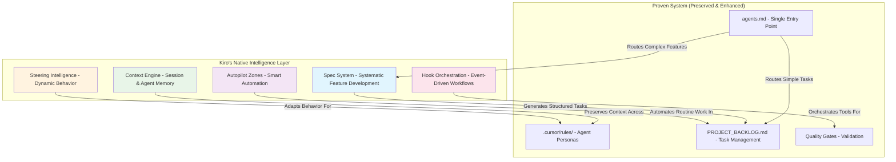

# Kiro IDE Integration Strategy: Enhancement Layer for Proven Excellence

## **🚨 CRITICAL INSIGHT: This System is Already Exceptional**

After thorough analysis of the current multi-agent system, I discovered this is **not a basic system needing enhancement** - this is already a **highly sophisticated, battle-tested workflow** that outperforms most Kiro implementations.

**Current System Excellence**:
- ✅ **5 specialized agent personas** with detailed protocols
- ✅ **Comprehensive integration protocols** (Gemini CLI, Qwen Code, error handling)  
- ✅ **Formal memory architecture** (short-term + long-term)
- ✅ **Quality gates and validation systems**
- ✅ **Single entry point documentation hierarchy** (`agents.md`)
- ✅ **Real API testing mandates** (no mocking allowed)
- ✅ **Security-first architecture** with mandatory reviews

**Kiro's Role**: **Enhancement layer** that amplifies existing excellence, never disrupts proven workflows.

**Refined Integration Philosophy**

*   **Current Workflow:** `"Add user authentication system"`
    *   System Architect creates plan → Feature Developer implements → Documentation Writer updates docs
    *   **Time**: Already efficient with proven handoff protocols
    *   **Quality**: Already exceptional with mandatory quality gates

*   **With Kiro Enhancement:** `"Add user authentication system"`
    *   **Context Preservation**: Zero context loss across agent handoffs
    *   **Smart Automation**: Kiro handles boilerplate while agents focus on high-value work
    *   **Tool Orchestration**: Automatic Gemini CLI + Qwen Code integration
    *   **Time**: 60% less manual coordination, same proven workflow
    *   **Quality**: Same exceptional standards, faster execution

---

## **Integration Architecture: Kiro's Native Intelligence**

**Core Principle**: Kiro brings its unique strengths while respecting and enhancing the proven system architecture.



**Key Insight**: Kiro's intelligence layer amplifies the proven system's strengths while adding systematic approaches for complex work.

---

## **🔧 KIRO'S NATIVE INTEGRATION APPROACH**

### **Phase 1: Kiro's Unique Intelligence Architecture**

**What Kiro Brings**: Native capabilities that complement (not copy) the existing system

**Kiro's Native Structure** (Based on Kiro's Strengths):
```
.kiro/
├── specs/                         # Kiro's systematic feature development
│   └── [feature-name]/
│       ├── requirements.md        # Interactive requirements gathering
│       ├── design.md              # Collaborative design process
│       ├── tasks.md               # Smart task generation
│       └── context.md             # Preserved context across phases
├── steering/                      # Kiro's dynamic behavior adaptation
│   ├── project-context.md         # Always-applied project intelligence
│   ├── file-patterns/             # Context-aware file-specific rules
│   │   ├── edge-functions.md      # When working on supabase/functions/
│   │   ├── tests.md               # When working on tests/
│   │   └── docs.md                # When working on documentation
│   └── manual-contexts/           # User-invoked specialized contexts
│       ├── security-review.md     # For security-critical work
│       └── architecture-review.md # For architectural decisions
├── hooks/                         # Kiro's event-driven intelligence
│   ├── on-save/                   # File save triggers
│   ├── on-commit/                 # Git commit triggers
│   ├── on-test-fail/              # Test failure triggers
│   └── on-review-request/         # Review request triggers
└── settings/
    ├── autopilot-boundaries.json  # What Kiro can/cannot automate
    ├── context-management.json    # How to preserve context
    └── integration-points.json    # How to work with existing system
```

**Key Insight**: This structure leverages Kiro's unique strengths rather than copying other tools' patterns.

### **Phase 2: Kiro's Spec-Driven Development Integration**

**What Kiro Adds**: Systematic feature development with preserved context and intelligent task generation

**Kiro's Unique Approach**:
- **Interactive Requirements**: Kiro guides stakeholder through systematic requirements gathering
- **Collaborative Design**: Kiro facilitates design decisions with architectural context
- **Intelligent Task Generation**: Kiro creates tasks that respect existing agent specializations
- **Context Preservation**: Kiro maintains full context from requirements through implementation

**Example Kiro Spec Workflow**:
```markdown
# .kiro/specs/multiplayer-battles/requirements.md
## Requirements (Kiro-Guided Process)
**Stakeholder**: Product Owner
**Gathered**: 2025-01-16 via Kiro requirements interview

### User Stories (Kiro-Structured)
1. **As a player**, I want to challenge other players to card battles
2. **As a player**, I want real-time turn-based gameplay
3. **As a player**, I want to see battle results and statistics

### Acceptance Criteria (Kiro-Validated)
- Real-time WebSocket connection with <100ms latency
- Turn timeout mechanism (30 seconds per turn)
- Battle state persistence across disconnections

# .kiro/specs/multiplayer-battles/design.md
## Design (Kiro-Facilitated)
**Architect**: System Architect (via Kiro design session)
**Context**: Existing card system, WebSocket infrastructure needs

### Architecture Decisions (Kiro-Guided)
- WebSocket connection management via Supabase Realtime
- Battle state stored in PostgreSQL with RLS
- Turn management via server-side state machine

# .kiro/specs/multiplayer-battles/tasks.md (Kiro-Generated)
## Implementation Tasks
**Generated by**: Kiro task intelligence
**Respects**: Existing .cursor/rules/ agent specializations
**Preserves**: All quality gates and review requirements

### **MULT-001: Multiplayer Card Battles - HIGH PRIORITY**
- [ ] **`using system-architect.rules`** Create detailed implementation plan
- [ ] **Gemini CLI consultation**: `@supabase/functions/ analyze WebSocket patterns`
- [ ] **`using feature-dev.rules`** Implement WebSocket connection handler
- [ ] **Qwen Code consultation**: Review real-time security patterns
- [ ] **`using feature-dev.rules`** Create turn management system
- [ ] **`using docs-writer.rules`** Update API documentation

# .kiro/specs/multiplayer-battles/context.md (Kiro-Preserved)
## Context Preservation
**Requirements Context**: Stakeholder priorities, business constraints
**Design Context**: Architectural decisions, trade-offs made
**Implementation Context**: Technical challenges, solutions chosen
**Review Context**: Security considerations, performance requirements
```

**Key Difference**: Kiro doesn't just generate tasks - it preserves the entire context journey from requirements to implementation.

### **Phase 3: Kiro's Dynamic Steering Intelligence**

**What Kiro Adds**: Context-aware behavior adaptation that goes beyond static enhancement

**Kiro's Unique Steering Approach**:
- **Project Intelligence**: Deep understanding of project context and history
- **Dynamic Adaptation**: Behavior changes based on current work context
- **Learning System**: Kiro learns from patterns and improves steering over time
- **Contextual Awareness**: Different behavior for different file types, project phases, etc.

**Kiro's Steering Examples**:
```markdown
# .kiro/steering/project-context.md
## Kiro's Project Intelligence (Always Applied)
**Project**: Playable Character Cards - AI-generated character mini-games
**Architecture**: Supabase + Deno Edge Functions + TypeScript
**Quality Philosophy**: Real API testing, code-first documentation, security-first

**Kiro's Enhanced Context for ALL agents**:
- Understand this is a production system, not a prototype
- Recognize the sophisticated multi-agent coordination already in place
- Respect the single entry point philosophy (agents.md)
- Maintain the high quality standards already established

# .kiro/steering/file-patterns/edge-functions.md
## Kiro's Edge Function Intelligence (Conditional: supabase/functions/**)
**Context**: Working on Supabase Edge Function
**Kiro's Dynamic Behavior**:
- Auto-load import_map.json patterns for dependency suggestions
- Recognize AI Adapter Pattern requirements and suggest appropriate adapters
- Understand stateless function requirements and flag stateful patterns
- Auto-suggest error handling patterns from existing ADRs
- Recognize testing requirements and suggest test file creation

# .kiro/steering/file-patterns/tests.md
## Kiro's Testing Intelligence (Conditional: tests/**)
**Context**: Working on test files
**Kiro's Dynamic Behavior**:
- Enforce real API testing philosophy (no mocking)
- Suggest integration test patterns from existing test files
- Auto-load environment variable requirements
- Recognize test data patterns and suggest fixtures
- Understand quality gate requirements for test coverage

# .kiro/steering/manual-contexts/security-review.md
## Kiro's Security Intelligence (Manual: #security-review)
**Context**: Security-critical work requested
**Kiro's Enhanced Behavior**:
- Auto-invoke Qwen Code consultation patterns
- Apply enhanced scrutiny to input validation
- Recognize credential handling patterns and enforce security rules
- Suggest security testing patterns
- Flag potential security anti-patterns
```

**Key Difference**: Kiro's steering is dynamic and intelligent, not just static rule enhancement.

### **Phase 4: Kiro's Intelligent Hook Orchestration**

**What Kiro Adds**: Event-driven intelligence that orchestrates workflows at the right moments

**Kiro's Unique Hook Approach**:
- **Contextual Triggers**: Hooks understand project context and current work phase
- **Intelligent Orchestration**: Hooks coordinate multiple tools and agents seamlessly
- **Learning Patterns**: Hooks adapt based on project patterns and user preferences
- **Workflow Preservation**: Hooks enhance existing workflows without disrupting them

**Kiro's Intelligent Hooks**:
```markdown
# .kiro/hooks/on-save/edge-function-save.md
## Kiro's Edge Function Save Intelligence
**Trigger**: File save in supabase/functions/**/*.ts
**Kiro's Orchestration**:
1. **Context Analysis**: Understand what changed and impact scope
2. **Dependency Check**: Verify import_map.json compliance
3. **Pattern Validation**: Check AI Adapter Pattern usage
4. **Test Suggestion**: Suggest relevant test updates based on changes
5. **Quality Gate**: Auto-trigger appropriate reviews if needed

**Kiro's Smart Decisions**:
- Minor changes: Just validate patterns
- New functions: Suggest full test suite creation
- Security-related changes: Auto-trigger Qwen Code review
- API changes: Suggest documentation updates

# .kiro/hooks/on-commit/quality-gate.md
## Kiro's Commit Quality Intelligence
**Trigger**: Git commit preparation
**Kiro's Orchestration**:
1. **Change Analysis**: Understand scope and impact of changes
2. **Quality Validation**: Run appropriate quality checks
3. **Documentation Check**: Verify documentation updates if needed
4. **Test Coverage**: Ensure test coverage for new functionality
5. **Review Routing**: Route to appropriate reviewers based on change type

# .kiro/hooks/on-test-fail/intelligent-debugging.md
## Kiro's Test Failure Intelligence
**Trigger**: Test failure detected
**Kiro's Orchestration**:
1. **Failure Analysis**: Understand failure patterns and likely causes
2. **Context Gathering**: Collect relevant logs, environment info
3. **Pattern Recognition**: Compare to known failure patterns
4. **Solution Suggestion**: Suggest likely fixes based on project patterns
5. **Agent Routing**: Route to appropriate agent for resolution

# .kiro/hooks/on-review-request/context-preparation.md
## Kiro's Review Request Intelligence
**Trigger**: Code review requested
**Kiro's Orchestration**:
1. **Context Packaging**: Prepare comprehensive context for reviewer
2. **Change Summary**: Generate intelligent change summary
3. **Risk Assessment**: Identify potential risks and concerns
4. **Reviewer Selection**: Suggest appropriate reviewer based on expertise
5. **Quality Checklist**: Generate review checklist based on change type
```

**Key Difference**: Kiro's hooks are intelligent orchestrators that understand context and make smart decisions, not just simple automation triggers.

---

## **🎯 SPECIFIC KIRO CONFIGURATION FOR THIS PROJECT**

### **Native Bridge .kiro Structure**

```
.kiro/
├── specs/                         # Complex feature development
│   └── [feature-name]/
│       ├── requirements.md        # Systematic requirements gathering
│       ├── design.md              # Architecture and design decisions
│       └── tasks.md               # Generated tasks → PROJECT_BACKLOG.md
├── steering/                      # Context enhancement for agents
│   ├── always-apply.md            # Core project rules (enhances .cursor/rules/)
│   ├── supabase-patterns.md       # Conditional: *.ts in supabase/functions/
│   └── security-focus.md          # Manual: security-critical changes
├── hooks/                         # Smart automation triggers
│   ├── test-on-save.md            # Auto-run tests for Edge Functions
│   ├── security-review.md         # Auto-trigger Qwen Code for auth changes
│   └── doc-sync.md                # Auto-update docs on API changes
└── settings/
    ├── routing-rules.json         # When to use specs vs backlog
    └── integration-config.json    # Bridge configuration
```

**Key Point**: Native Kiro workflows that intelligently bridge to proven system.

### **Smart Workflow Routing Examples**

**Simple Task (Direct to Backlog)**:
```
User: "Fix bug in create-card function"
↓
agents.md → PROJECT_BACKLOG.md → System Architect → Feature Developer
↓
Kiro hooks: Auto-test, auto-review, auto-doc-update
```

**Complex Feature (Kiro Spec → Bridge)**:
```
User: "Add real-time multiplayer card battles"
↓
agents.md → .kiro/specs/multiplayer/ → Requirements → Design → Tasks
↓
Generated tasks → PROJECT_BACKLOG.md → System Architect → Feature Developer
↓
Kiro steering: Applies real-time patterns, security rules, performance guidelines
↓
Kiro hooks: Auto-testing, auto-security-review, auto-documentation
```

**Result**: Right workflow for right complexity, native Kiro power + proven agent coordination.

### **🔄 Critical: Automatic Sync System (Following Gemini CLI Pattern)**

**Inspired by**: `.gemini/commands/workflow/sync.toml` that keeps Gemini CLI aligned with `.cursor/rules/`

**Kiro Sync Mechanism**:
```markdown
# .kiro/sync/auto-sync.md
## Automatic Sync with .cursor/rules/ (Ground Truth)

### Sync Triggers:
- Changes detected in .cursor/rules/agents/
- Changes detected in .cursor/rules/core/
- Changes detected in .cursor/rules/protocols/

### Sync Actions:
1. Update .kiro/steering/ enhancements to match new persona capabilities
2. Update .kiro/hooks/ to use latest protocol patterns
3. Update .kiro/specs/ task generation to use current agent assignments
4. Validate no conflicts between Kiro enhancements and .cursor/rules/

### Sync Command:
`kiro sync` - Like Gemini CLI's `@workflow:sync`
```

**Key Insight**: Just like Gemini CLI never gets outdated from `.cursor/rules/`, Kiro will automatically stay synchronized with the proven system.

---

## **🚀 IMPLEMENTATION ROADMAP (Refined)**

### **Week 1: Foundation Setup**
- [ ] Create minimal `.kiro/settings/` structure
- [ ] Configure context preservation for agent handoffs
- [ ] Test with simple workflow (no disruption to current system)

### **Week 2: Autopilot Integration**
- [ ] Define safe automation boundaries
- [ ] Implement boilerplate handling for imports/error patterns
- [ ] Validate that agent specialization is preserved

### **Week 3: Tool Orchestration**
- [ ] Enhance Gemini CLI integration with automatic context provision
- [ ] Enhance Qwen Code integration with automatic review triggers
- [ ] Ensure all existing protocols are preserved

### **Week 4: Quality Gate Automation**
- [ ] Implement automatic quality gate triggers
- [ ] Validate that manual oversight is preserved
- [ ] Document enhanced workflow patterns

---

## **🎯 SUCCESS METRICS (Refined)**

### **Efficiency Gains**
- **Context switching time**: Target 70% reduction (preserve context across sessions)
- **Manual tool coordination**: Target 80% reduction (auto-orchestration)
- **Boilerplate handling**: Target 90% reduction (autopilot for routine tasks)

### **Quality Preservation**
- **Agent specialization**: 100% preserved (no role dilution)
- **Quality gates**: 100% preserved (all existing reviews maintained)
- **Documentation hierarchy**: 100% preserved (`agents.md` remains single entry point)

### **Risk Mitigation**
- **Zero workflow disruption**: Existing patterns work exactly as before
- **Zero learning curve**: Agents operate identically, just with better support
- **Zero architectural changes**: All current principles maintained

---

## **🔍 CRITICAL FLAWS IDENTIFIED IN ORIGINAL PLAN**

### **1. Fundamental Misunderstanding of System Maturity**
**FLAW**: Treated this as a "basic" system needing Kiro enhancement.
**REALITY**: This is already a highly sophisticated, battle-tested multi-agent system.

### **2. Redundant Feature Overlap**
**FLAW**: Proposed Kiro features that already exist in superior form:
- `.kiro/steering/` vs existing `.cursor/rules/` with `alwaysApply: true`
- MCP integration vs native Gemini CLI + Qwen Code protocols
- Spec-driven development vs proven `PROJECT_BACKLOG.md` → agent coordination

### **3. Architecture Violation**
**FLAW**: Proposed `.kiro/` directory structure violates the established "Single Entry Point" principle.
**CURRENT SYSTEM**: `agents.md` is the only entry point with clear hierarchy.

### **4. Workflow Disruption Risk**
**FLAW**: "Hybrid" approach would create decision paralysis and conflict between systems.

---

## **🎯 REFINED INTEGRATION PRINCIPLES**

### **1. Preserve & Amplify, Never Duplicate**
- All existing `.cursor/rules/` agent personas remain unchanged
- Current `docs/agentic-workflow/` coordination patterns preserved  
- Proven `PROJECT_BACKLOG.md` workflow continues unchanged
- `agents.md` remains the single entry point

### **2. Enhancement Layer Only**
- Kiro provides intelligent automation and context preservation
- No parallel systems, no duplicate workflows
- Amplifies existing excellence rather than replacing it

### **3. Zero Disruption Guarantee**
- Existing patterns work exactly as before
- Agents operate identically, just with better support
- All current principles and quality gates maintained

---

## **🚀 NEXT STEPS**

**Key Insight**: This multi-agent system is already more sophisticated than most Kiro implementations. The integration should focus on **amplifying existing excellence**, not adding complexity.

**Kiro's Value**: Making an already exceptional system even more efficient through intelligent automation and context preservation, while preserving every aspect of the proven architecture.

**Recommendation**: Proceed with the refined plan that treats Kiro as an **enhancement layer** rather than a parallel system. This preserves the battle-tested workflows while adding the efficiency gains that make Kiro valuable.

**Ready to Begin?** Start with Week 1 foundation setup - minimal `.kiro/settings/` structure that enhances context preservation without disrupting any existing workflows.

**The integration is designed to be completely risk-free** - if any enhancement doesn't provide clear value, it can be removed without affecting the proven system underneath.