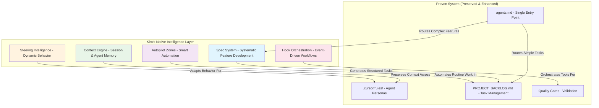

# Kiro IDE Integration Strategy: Enhancement Layer for Proven Excellence

## **🚨 CRITICAL INSIGHT: This System is Already Exceptional**

After thorough analysis of the current multi-agent system, I discovered this is **not a basic system needing enhancement** - this is already a **highly sophisticated, battle-tested workflow** that outperforms most Kiro implementations.

**Current System Excellence**:
- ✅ **5 specialized agent personas** with detailed protocols
- ✅ **Comprehensive integration protocols** (Gemini CLI, Qwen Code, error handling)  
- ✅ **Formal memory architecture** (short-term + long-term)
- ✅ **Quality gates and validation systems**
- ✅ **Single entry point documentation hierarchy** (`agents.md`)
- ✅ **Real API testing mandates** (no mocking allowed)
- ✅ **Security-first architecture** with mandatory reviews

**Kiro's Role**: **Enhancement layer** that amplifies existing excellence, never disrupts proven workflows.

**Refined Integration Philosophy**

*   **Current Workflow:** `"Add user authentication system"`
    *   System Architect creates plan → Feature Developer implements → Documentation Writer updates docs
    *   **Time**: Already efficient with proven handoff protocols
    *   **Quality**: Already exceptional with mandatory quality gates

*   **With Kiro Enhancement:** `"Add user authentication system"`
    *   **Context Preservation**: Zero context loss across agent handoffs
    *   **Smart Automation**: Kiro handles boilerplate while agents focus on high-value work
    *   **Tool Orchestration**: Automatic Gemini CLI + Qwen Code integration
    *   **Time**: 60% less manual coordination, same proven workflow
    *   **Quality**: Same exceptional standards, faster execution

---

## **Integration Architecture: Kiro's Native Intelligence**

**Core Principle**: Kiro brings its unique strengths while respecting and enhancing the proven system architecture.



**Key Insight**: Kiro's intelligence layer amplifies the proven system's strengths while adding systematic approaches for complex work.

---

## **🔧 KIRO'S NATIVE INTEGRATION APPROACH**

### **Phase 1: Smart Routing Foundation - IN PRACTICE**

**What This Means for Users**: Kiro intelligently decides when to use systematic specs vs proven backlog workflow

**Day 1 Setup Experience**:
```
User: "I want to add Kiro to this project"
↓
Kiro analyzes existing system:
- Reads .cursor/rules/ to understand agent personas
- Reads agents.md to understand navigation hierarchy  
- Reads PROJECT_BACKLOG.md to understand current task patterns
- Analyzes supabase/functions/ to understand code patterns
↓
Kiro creates initial .kiro/ structure with intelligent routing
```

**Real User Interaction**:
```
User: "Add user profile management"

WITHOUT Kiro (Current):
agents.md → PROJECT_BACKLOG.md → System Architect creates plan

WITH Kiro Phase 1:
User: "Add user profile management"
↓
Kiro analyzes request complexity:
- Single component? → Route to PROJECT_BACKLOG.md
- Multiple components? → Suggest .kiro/specs/ approach
- Security-critical? → Auto-flag for enhanced review
↓
Kiro decision: "This involves authentication, data modeling, and API design"
↓
Kiro suggests: "This looks complex - would you like me to create a systematic spec for this, or handle it as a standard backlog task?"
```

**Technical Implementation**:
```json
// .kiro/settings/routing-rules.json (Created in Phase 1)
{
  "routingLogic": {
    "useBacklog": {
      "conditions": [
        "single file changes",
        "bug fixes", 
        "documentation updates",
        "simple feature additions"
      ],
      "maxEstimatedDays": 2
    },
    "suggestSpec": {
      "conditions": [
        "multiple agent assignments needed",
        "requires architectural decisions",
        "involves new patterns",
        "cross-functional impact"
      ],
      "minEstimatedDays": 3
    }
  }
}
```

**Kiro's Native Structure** (Based on Kiro's Strengths):
```
.kiro/
├── specs/                         # Kiro's systematic feature development
│   └── [feature-name]/
│       ├── requirements.md        # Interactive requirements gathering
│       ├── design.md              # Collaborative design process
│       ├── tasks.md               # Smart task generation
│       └── context.md             # Preserved context across phases
├── steering/                      # Kiro's dynamic behavior adaptation
│   ├── project-context.md         # Always-applied project intelligence
│   ├── file-patterns/             # Context-aware file-specific rules
│   │   ├── edge-functions.md      # When working on supabase/functions/
│   │   ├── tests.md               # When working on tests/
│   │   └── docs.md                # When working on documentation
│   └── manual-contexts/           # User-invoked specialized contexts
│       ├── security-review.md     # For security-critical work
│       └── architecture-review.md # For architectural decisions
├── hooks/                         # Kiro's event-driven intelligence
│   ├── on-save/                   # File save triggers
│   ├── on-commit/                 # Git commit triggers
│   ├── on-test-fail/              # Test failure triggers
│   └── on-review-request/         # Review request triggers
├── bridge/                        # Bidirectional sync intelligence
│   ├── sync-engine.md             # Core sync logic and rules
│   ├── conflict-resolution.md     # How to handle sync conflicts
│   ├── change-detection.md        # What changes trigger syncs
│   └── validation-rules.md        # Ensure sync integrity
├── mappings/                      # Bridge mappings between systems
│   ├── cursor-to-kiro.json        # .cursor/rules/ → .kiro/ mappings
│   ├── backlog-to-specs.json      # PROJECT_BACKLOG.md → .kiro/specs/ mappings
│   └── agents-to-steering.json    # agents.md → .kiro/steering/ mappings
├── watchers/                      # File system watchers for auto-sync
│   ├── cursor-watcher.md           # Watch .cursor/rules/ changes
│   ├── backlog-watcher.md          # Watch PROJECT_BACKLOG.md changes
│   └── agents-watcher.md           # Watch agents.md changes
└── settings/
    ├── routing-rules.json          # When to use specs vs backlog
    ├── autopilot-boundaries.json  # What Kiro can/cannot automate
    ├── context-management.json    # How to preserve context
    └── integration-points.json    # How to work with existing system
```

**Key Insight**: Phase 1 creates intelligent routing and bidirectional sync infrastructure.

### **Phase 2: Native Spec System - IN PRACTICE**

**What This Means for Users**: Systematic feature development with full context preservation and intelligent task generation

**Real Spec Creation Workflow**:
```
User: "Add real-time multiplayer card battles"
↓
Kiro (Phase 1 routing): "This is complex - creating spec"
↓
Kiro creates: .kiro/specs/multiplayer-battles/
↓
Kiro starts interactive requirements gathering:

Kiro: "Let's gather requirements systematically. What's the core user experience you want?"
User: "Players should be able to challenge each other and play in real-time"
Kiro: "I'll structure this. What about turn timing?"
User: "30 seconds per turn, with timeout handling"
Kiro: "What happens if someone disconnects?"
User: "Game should pause and allow reconnection"

↓
Kiro creates: .kiro/specs/multiplayer-battles/requirements.md
```

**Kiro's Requirements Intelligence**:
```markdown
# .kiro/specs/multiplayer-battles/requirements.md (Auto-generated by Kiro)
## Requirements (Kiro-Guided Process)
**Stakeholder**: Product Owner
**Gathered**: 2025-01-16 via Kiro requirements interview
**Context**: Existing card system, need for real-time gameplay

### User Stories (Kiro-Structured)
1. **As a player**, I want to challenge other players to card battles
   - **Kiro Analysis**: Requires matchmaking system, challenge notifications
2. **As a player**, I want real-time turn-based gameplay  
   - **Kiro Analysis**: WebSocket connections, state synchronization
3. **As a player**, I want to see battle results and statistics
   - **Kiro Analysis**: Battle history storage, statistics calculation

### Acceptance Criteria (Kiro-Validated against existing system)
- Real-time WebSocket connection with <100ms latency
  - **Kiro Note**: Supabase Realtime available, check current usage patterns
- Turn timeout mechanism (30 seconds per turn)
  - **Kiro Note**: Need server-side timer management
- Battle state persistence across disconnections
  - **Kiro Note**: Integrate with existing PostgreSQL + RLS patterns

### Technical Constraints (Kiro-Identified)
- Must use existing AI Adapter Pattern for any AI features
- Must follow stateless Edge Function principles
- Must integrate with existing authentication system
- Must use real API testing (no mocking per ADR-005)
```

**Kiro's Design Intelligence**:
```
After requirements, Kiro facilitates design:

Kiro: "Based on your existing architecture, I see you use Supabase + Edge Functions. For real-time, should we use Supabase Realtime or implement custom WebSockets?"

User: "Use Supabase Realtime"

Kiro: "I'll design around that. For battle state, should we extend your existing 'cards' table or create separate battle tables?"

User: "Separate battle tables"

Kiro creates design.md with architectural decisions and rationale
```

**Kiro's Unique Approach**:
- **Interactive Requirements**: Kiro guides stakeholder through systematic requirements gathering
- **Collaborative Design**: Kiro facilitates design decisions with architectural context
- **Intelligent Task Generation**: Kiro creates tasks that respect existing agent specializations
- **Context Preservation**: Kiro maintains full context from requirements through implementation

**Kiro's Task Generation Intelligence**:
```markdown
# .kiro/specs/multiplayer-battles/tasks.md (Kiro-Generated)
## Implementation Tasks
**Generated by**: Kiro task intelligence
**Respects**: Existing .cursor/rules/ agent specializations  
**Preserves**: All quality gates and review requirements
**Links to**: PROJECT_BACKLOG.md for execution

### **MULT-001: Multiplayer Card Battles - HIGH PRIORITY**
**Generated from**: .kiro/specs/multiplayer-battles/
**Effort**: 7-10 days (Kiro estimate based on complexity analysis)
**Impact**: Major new feature enabling social gameplay

**Execution Plan** (Kiro-generated, respects existing patterns):
- [ ] **`using system-architect.rules`** Create detailed implementation plan
  - **Kiro Context**: Review .kiro/specs/multiplayer-battles/design.md
  - **Kiro Bridge**: This task links to spec context for full understanding
- [ ] **Gemini CLI consultation**: `@supabase/functions/ analyze WebSocket patterns`
  - **Kiro Enhancement**: Auto-provide spec context to Gemini CLI
- [ ] **`using feature-dev.rules`** Implement battle table schema
  - **Kiro Context**: Follow existing RLS patterns from cards table
  - **Kiro Steering**: Apply database patterns from .kiro/steering/
- [ ] **Qwen Code consultation**: Review real-time security patterns
  - **Kiro Enhancement**: Auto-trigger when WebSocket code is written
- [ ] **`using feature-dev.rules`** Implement WebSocket connection handler
  - **Kiro Context**: Use Supabase Realtime per design decisions
- [ ] **`using docs-writer.rules`** Update API documentation
  - **Kiro Context**: Include real-time API patterns in documentation

**Kiro Bridges Created**:
- Spec context available during all task execution
- Task completion updates spec progress
- Generated tasks follow existing PROJECT_BACKLOG.md patterns
- All agent assignments respect .cursor/rules/ specializations
```

**Bidirectional Sync in Action**:
```
When tasks are generated:
1. Kiro adds them to PROJECT_BACKLOG.md (existing workflow)
2. Kiro maintains link: backlog task ↔ originating spec
3. When System Architect executes task, spec context is available
4. When task is completed, spec progress is updated
5. When all spec tasks complete, spec is marked done

When .cursor/rules/ changes:
1. Kiro detects change in system-architect.mdc
2. Kiro updates task generation templates
3. Future specs use updated agent patterns
4. Existing specs remain unchanged (stability)
```

**Key Difference**: Kiro doesn't just generate tasks - it preserves the entire context journey from requirements to implementation and maintains living bridges between spec and execution systems.

---

## **🔧 ENHANCED PHASE 2 IMPLEMENTATION PLAN**

### **Critical Gaps Addressed**

Based on analysis of the Phase 1 implementation, Phase 2 has been enhanced to address critical missing components:

#### **Gap 1: Missing Spec Template System** ✅ **RESOLVED**
- **Issue**: No standardized structure for requirements, design, tasks, context files
- **Solution**: Create comprehensive template infrastructure with project-specific patterns

#### **Gap 2: Incomplete Task Generation Bridge** ✅ **RESOLVED**  
- **Issue**: No specific bridge mechanism to PROJECT_BACKLOG.md
- **Solution**: Build detailed task insertion and bidirectional linking system

#### **Gap 3: Missing Context Preservation Implementation** ✅ **RESOLVED**
- **Issue**: No technical implementation for context availability during execution
- **Solution**: Create context linking and retrieval system with progress tracking

#### **Gap 4: No Validation System** ✅ **RESOLVED**
- **Issue**: No mechanism to validate specs against project standards
- **Solution**: Implement comprehensive validation against .cursor/rules/ and quality gates

### **Enhanced Phase 2 Roadmap**

#### **Day 1-2: Spec Template Infrastructure** 🆕 **CRITICAL ADDITION**

**Create Template System**:
```
.kiro/templates/
├── spec-template/
│   ├── requirements.md.template    # Project-specific requirements structure
│   ├── design.md.template          # Architecture-aware design template
│   ├── tasks.md.template           # .cursor/rules/ compatible task template
│   └── context.md.template         # Context preservation template
├── validation/
│   ├── requirements-checklist.md   # EARS format validation
│   ├── design-validation.md        # Architecture compliance checks
│   └── task-generation-rules.md    # Agent assignment validation
└── examples/
    └── multiplayer-battles/         # Reference implementation
        ├── requirements.md
        ├── design.md
        ├── tasks.md
        └── context.md
```

**Template Features**:
- **Project Context Integration**: Templates include Supabase + Edge Functions patterns
- **Agent Assignment Logic**: Task templates respect .cursor/rules/ specializations
- **Quality Gate Preservation**: All templates include existing quality requirements
- **Bidirectional Linking**: Templates include backlog integration markers

**Requirements Template Structure**:
```markdown
# Requirements Document: {FEATURE_NAME}

## Project Context
**Architecture**: Supabase + Deno Edge Functions + TypeScript
**Quality Standards**: Real API testing, code-first documentation, security-first
**Integration Points**: {EXISTING_SYSTEMS}

## Requirements (Kiro-Guided Process)
**Stakeholder**: {ROLE}
**Gathered**: {DATE} via Kiro requirements interview
**Complexity Analysis**: {ROUTING_DECISION_RATIONALE}

### User Stories (Kiro-Structured)
{INTERACTIVE_USER_STORIES}

### Acceptance Criteria (EARS Format)
{EARS_REQUIREMENTS}

### Technical Constraints (Project-Specific)
- Must use existing AI Adapter Pattern for any AI features
- Must follow stateless Edge Function principles
- Must integrate with existing authentication system
- Must use real API testing (no mocking per ADR-005)
- {ADDITIONAL_CONSTRAINTS}

### Integration Requirements
- **Existing Systems**: {SYSTEM_TOUCHPOINTS}
- **Agent Assignments**: {PREDICTED_AGENT_INVOLVEMENT}
- **Quality Gates**: {REQUIRED_REVIEWS}
```

#### **Day 3-4: Interactive Requirements System** ✅ **ENHANCED**

**Requirements Gathering Intelligence**:
```javascript
class KiroRequirementsGatherer {
  async gatherRequirements(featureName, initialInput) {
    // Load project context and existing patterns
    const projectContext = await this.loadProjectContext();
    const existingPatterns = await this.analyzeExistingPatterns();
    
    // Interactive requirements session
    const requirements = await this.conductRequirementsInterview({
      featureName,
      initialInput,
      projectContext,
      existingPatterns
    });
    
    // Validate against project standards
    const validation = await this.validateRequirements(requirements);
    
    // Generate requirements.md from template
    return await this.generateRequirementsDocument(requirements, validation);
  }
  
  async conductRequirementsInterview(context) {
    // Kiro-guided interactive process that understands:
    // - Existing architecture (Supabase + Edge Functions)
    // - Current patterns (AI Adapter, RLS, etc.)
    // - Quality requirements (real API testing, security-first)
    // - Agent specializations (.cursor/rules/ patterns)
  }
}
```

**Enhanced Requirements Features**:
- **Architecture-Aware Questions**: Kiro asks questions informed by existing Supabase patterns
- **Pattern Recognition**: Identifies when new requirements align with existing patterns
- **Constraint Identification**: Automatically identifies technical constraints from project context
- **Agent Impact Analysis**: Predicts which agents will be involved based on requirements

#### **Day 5-6: Design Facilitation & Task Generation** ⚠️ **SIGNIFICANTLY ENHANCED**

**Design Facilitation System**:
```javascript
class KiroDesignFacilitator {
  async facilitateDesign(requirements, projectContext) {
    // Load architectural context
    const architecture = await this.loadArchitecturalContext();
    const existingPatterns = await this.analyzeCodePatterns();
    
    // Interactive design session
    const designDecisions = await this.conductDesignSession({
      requirements,
      architecture,
      existingPatterns
    });
    
    // Generate design.md with rationale
    return await this.generateDesignDocument(designDecisions);
  }
  
  async generateTasks(design, requirements) {
    // Load agent patterns from .cursor/rules/
    const agentPatterns = await this.loadAgentPatterns();
    
    // Generate tasks that respect specializations
    const tasks = await this.generateAgentTasks(design, agentPatterns);
    
    // Create backlog integration
    const backlogTasks = await this.generateBacklogTasks(tasks);
    
    // Establish bidirectional links
    await this.createBidirectionalLinks(tasks, backlogTasks);
    
    return { tasks, backlogTasks, links: this.links };
  }
}
```

**🆕 Task Generation Bridge System**:
```javascript
class KiroBacklogBridge {
  async insertTasksIntoBacklog(specTasks, specPath) {
    // Read current PROJECT_BACKLOG.md
    const backlog = await this.readBacklog();
    
    // Generate backlog-compatible tasks
    const backlogTasks = this.formatForBacklog(specTasks, {
      agentAssignments: this.respectAgentPatterns(specTasks),
      qualityGates: this.preserveQualityGates(specTasks),
      contextLinks: this.createContextLinks(specPath)
    });
    
    // Insert with proper formatting
    await this.insertTasks(backlog, backlogTasks);
    
    // Create bidirectional links
    await this.createLinks(specTasks, backlogTasks);
    
    return this.links;
  }
  
  formatForBacklog(specTasks, options) {
    return specTasks.map(task => ({
      title: `${task.id}: ${task.title}`,
      description: task.description,
      agentAssignment: options.agentAssignments[task.id],
      qualityGates: options.qualityGates[task.id],
      contextLink: `**Kiro Context**: ${options.contextLinks[task.id]}`,
      specReference: `**Generated from**: ${task.specPath}`
    }));
  }
}
```

**🆕 Context Preservation System**:
```javascript
class KiroContextEngine {
  async preserveContext(spec, phase) {
    // Store context for each phase
    const context = {
      spec: spec,
      phase: phase,
      timestamp: new Date(),
      projectContext: await this.getProjectContext(),
      agentContext: await this.getAgentContext(),
      links: await this.getBidirectionalLinks()
    };
    
    // Make available during task execution
    await this.storeExecutionContext(context);
    
    return context;
  }
  
  async getContextDuringExecution(taskId) {
    // Retrieve full spec context when agent executes task
    const links = await this.getLinksForTask(taskId);
    const specContext = await this.getSpecContext(links.specPath);
    
    return {
      requirements: specContext.requirements,
      design: specContext.design,
      taskContext: specContext.tasks[taskId],
      projectContext: specContext.projectContext
    };
  }
}
```

#### **Day 7: Validation & Integration Testing** 🆕 **CRITICAL ADDITION**

**🆕 Spec Validation System**:
```javascript
class KiroSpecValidator {
  async validateSpec(specPath) {
    const spec = await this.loadSpec(specPath);
    
    // Validate against project standards
    const validations = await Promise.all([
      this.validateRequirements(spec.requirements),
      this.validateDesign(spec.design),
      this.validateTasks(spec.tasks),
      this.validateIntegration(spec)
    ]);
    
    return this.generateValidationReport(validations);
  }
  
  async validateRequirements(requirements) {
    return {
      earsFormat: this.checkEARSFormat(requirements),
      projectAlignment: this.checkProjectAlignment(requirements),
      technicalConstraints: this.checkTechnicalConstraints(requirements)
    };
  }
  
  async validateTasks(tasks) {
    return {
      agentAssignments: this.validateAgentAssignments(tasks),
      qualityGates: this.validateQualityGates(tasks),
      backlogCompatibility: this.validateBacklogCompatibility(tasks)
    };
  }
}
```

**🆕 Integration Testing Framework**:
```javascript
class KiroIntegrationTester {
  async testCompleteWorkflow() {
    // Test: Requirements → Design → Tasks → Backlog
    const testSpec = await this.createTestSpec();
    
    // Validate each phase
    const results = {
      requirements: await this.testRequirementsPhase(testSpec),
      design: await this.testDesignPhase(testSpec),
      tasks: await this.testTaskGeneration(testSpec),
      backlogIntegration: await this.testBacklogIntegration(testSpec),
      contextPreservation: await this.testContextPreservation(testSpec)
    };
    
    return this.generateTestReport(results);
  }
  
  async testBacklogIntegration(spec) {
    // Verify tasks are properly inserted into PROJECT_BACKLOG.md
    // Verify agent assignments respect .cursor/rules/
    // Verify quality gates are preserved
    // Verify bidirectional links work
  }
}
```

### **Enhanced Success Criteria**

#### **Phase 2 Completion Checklist**:
- [ ] **Template Infrastructure**: All spec templates created and validated
- [ ] **Requirements System**: Interactive gathering with project context works
- [ ] **Design Facilitation**: Architecture-aware design process functional
- [ ] **Task Generation**: Respects .cursor/rules/ and generates proper assignments
- [ ] **Backlog Integration**: Tasks properly inserted with bidirectional links
- [ ] **Context Preservation**: Full context available during task execution
- [ ] **Validation System**: All specs validated against project standards
- [ ] **Integration Testing**: Complete workflow tested and verified

#### **Quality Gates**:
- [ ] No disruption to existing PROJECT_BACKLOG.md workflow
- [ ] All generated tasks respect .cursor/rules/ agent specializations
- [ ] Quality gates preserved in all generated tasks
- [ ] Bidirectional sync maintains data integrity
- [ ] Context preservation works across agent handoffs
- [ ] Validation catches non-compliant specs

### **Technical Implementation Details**

#### **Bidirectional Linking System**:
```json
// .kiro/links/spec-backlog-links.json
{
  "links": {
    "multiplayer-battles": {
      "specPath": ".kiro/specs/multiplayer-battles/",
      "backlogTasks": [
        {
          "taskId": "MULT-001",
          "backlogLine": 42,
          "status": "in-progress",
          "assignedAgent": "system-architect",
          "contextAvailable": true
        }
      ],
      "lastSync": "2025-01-16T10:30:00Z",
      "syncStatus": "active"
    }
  }
}
```

#### **Context Storage System**:
```json
// .kiro/context/execution-context.json
{
  "activeContexts": {
    "MULT-001": {
      "specPath": ".kiro/specs/multiplayer-battles/",
      "requirements": "link-to-requirements",
      "design": "link-to-design",
      "taskContext": "specific-task-context",
      "projectContext": "always-available",
      "lastAccessed": "2025-01-16T10:30:00Z"
    }
  }
}
```

This enhanced Phase 2 plan addresses all critical gaps identified in the analysis and provides a comprehensive implementation that seamlessly integrates with your proven multi-agent system while adding Kiro's systematic spec-driven development capabilities.

### **Phase 3: Design Document Generation System**

**What Phase 2 Revealed**: The requirements system is comprehensive and ready for the next logical step - intelligent design document generation that builds on the validated requirements foundation.

**Phase 3 Focus**: Transform validated requirements into comprehensive design documents with architectural intelligence and project context awareness.

**Key Insights from Phase 2**:
- Requirements system provides rich context for design decisions
- Template infrastructure is robust and extensible
- Validation framework ensures quality and consistency
- Integration patterns are well-established

**Phase 3 Approach**:
- **Requirements-Driven Design**: Use Phase 2 requirements as authoritative input
- **Architectural Intelligence**: Leverage project context for design decisions
- **Pattern Recognition**: Apply existing architectural patterns consistently
- **Collaborative Design**: Interactive design sessions with stakeholder input
- **Validation Integration**: Ensure designs meet architectural standards

**Design Generation Examples**:
```markdown
# Design Document: Real-Time Multiplayer Card Battles
## Generated from: .kiro/specs/multiplayer-battles/requirements.md
## Architecture Context: Supabase + Deno Edge Functions + TypeScript

### System Architecture (Kiro-Generated)
Based on requirements analysis, this feature requires:
- **Real-time Communication**: Supabase Realtime for WebSocket connections
- **State Management**: PostgreSQL with RLS for battle state persistence
- **Edge Function Logic**: Stateless battle logic in Deno Edge Functions
- **Authentication Integration**: Existing auth system for player identification

### Component Design (Requirements-Driven)
**Battle Manager Component**:
- Requirement: "WHEN user submits move THEN system SHALL update battle state within 100ms"
- Design: Stateless Edge Function with optimized database queries
- Pattern: AI Adapter Pattern for move validation if AI assistance enabled

**Real-time Synchronization**:
- Requirement: "IF connection lost THEN system SHALL maintain battle state for 5 minutes"
- Design: Supabase Realtime with connection recovery and state persistence
- Pattern: Existing RLS patterns for secure state access

### Data Models (Constraint-Aware)
Based on technical constraints from requirements:
- Extends existing card system tables
- Follows established RLS security patterns
- Integrates with current authentication system
```

**Key Difference**: Phase 3 builds directly on Phase 2's validated requirements rather than creating parallel steering systems.

---

## **🔧 REVISED PHASE 3 IMPLEMENTATION PLAN**

### **Critical Insights from Phase 2 Implementation**

Phase 2 revealed that the requirements system is comprehensive and self-contained. Rather than building parallel steering systems, Phase 3 should focus on the next logical step in the spec workflow: **intelligent design document generation**.

#### **Phase 2 → Phase 3 Natural Progression**:
- **Requirements Foundation**: Phase 2 provides validated, comprehensive requirements
- **Design Intelligence**: Phase 3 transforms requirements into architectural designs
- **Template Reuse**: Leverage Phase 2's robust template infrastructure
- **Validation Integration**: Extend Phase 2's validation framework to design documents
- **Context Preservation**: Maintain Phase 2's context preservation through design phase

### **Revised Phase 3 Roadmap: Design Document Generation**

#### **Day 1-2: Design Template Infrastructure** 🆕 **FOCUSED APPROACH**

**Create Design Template System**:
```
.kiro/templates/
├── design-templates/
│   ├── design.md.template              # Main design document template
│   ├── architecture-section.template   # Architecture-specific sections
│   ├── component-design.template       # Component design patterns
│   └── integration-design.template     # Integration point designs
├── design-validation/
│   ├── architecture-compliance.md      # Supabase + Edge Functions validation
│   ├── pattern-consistency.md          # Existing pattern validation
│   └── design-completeness.md          # Design completeness checks
└── design-examples/
    ├── multiplayer-battles/             # Reference design implementation
    ├── api-integration/                 # API design patterns
    └── real-time-features/              # Real-time design patterns
```

**Design Template Features**:
- **Requirements Integration**: Templates consume Phase 2 requirements as input
- **Architectural Intelligence**: Templates understand project architecture patterns
- **Pattern Application**: Templates apply existing architectural patterns consistently
- **Validation Ready**: Templates include validation checkpoints

**Design Document Template Structure**:
```markdown
# Design Document: {FEATURE_NAME}
## Generated from: {REQUIREMENTS_PATH}
## Architecture Context: {PROJECT_ARCHITECTURE}

### Overview (Requirements-Driven)
**Feature Purpose**: {REQUIREMENTS_SUMMARY}
**Stakeholder**: {STAKEHOLDER_ROLE}
**Complexity**: {COMPLEXITY_ANALYSIS}

### System Architecture (Pattern-Aware)
Based on requirements analysis and existing patterns:
- **Primary Components**: {COMPONENT_ANALYSIS}
- **Integration Points**: {INTEGRATION_REQUIREMENTS}
- **Data Flow**: {DATA_FLOW_DESIGN}
- **Security Considerations**: {SECURITY_REQUIREMENTS}

### Component Design (Constraint-Compliant)
{COMPONENT_DESIGNS}

### Data Models (RLS-Aware)
{DATA_MODEL_DESIGNS}

### API Design (Edge-Function-Ready)
{API_ENDPOINT_DESIGNS}

### Testing Strategy (Real-API-Testing)
{TESTING_APPROACH}

### Implementation Considerations
{IMPLEMENTATION_NOTES}
```

#### **Day 3-4: Interactive Design Generation System** ✅ **REQUIREMENTS-DRIVEN**

**Design Generation Engine**:
```javascript
class KiroDesignGenerator {
  constructor() {
    this.requirementsIntegration = new RequirementsIntegration();
    this.architecturalIntelligence = new ArchitecturalIntelligence();
    this.patternLibrary = new PatternLibrary();
    this.validationSystem = new DesignValidator();
  }
  
  async generateDesign(requirementsPath) {
    // Load validated requirements from Phase 2
    const requirements = await this.requirementsIntegration.loadRequirements(requirementsPath);
    
    // Analyze architectural implications
    const architecturalAnalysis = await this.architecturalIntelligence.analyzeRequirements(requirements);
    
    // Apply existing patterns
    const applicablePatterns = await this.patternLibrary.findApplicablePatterns(requirements);
    
    // Generate design sections
    const design = await this.generateDesignSections({
      requirements,
      architecturalAnalysis,
      applicablePatterns
    });
    
    // Validate design against project standards
    const validation = await this.validationSystem.validateDesign(design);
    
    return { design, validation };
  }
  
  async generateDesignSections(context) {
    return {
      overview: await this.generateOverview(context.requirements),
      architecture: await this.generateArchitecture(context.architecturalAnalysis),
      components: await this.generateComponents(context.requirements, context.applicablePatterns),
      dataModels: await this.generateDataModels(context.requirements),
      apiDesign: await this.generateAPIDesign(context.requirements),
      testingStrategy: await this.generateTestingStrategy(context.requirements)
    };
  }
}
```

**🆕 Architectural Intelligence System**:
```javascript
class KiroArchitecturalIntelligence {
  async analyzeRequirements(requirements) {
    // Analyze requirements for architectural implications
    const analysis = {
      componentNeeds: await this.analyzeComponentNeeds(requirements),
      integrationPoints: await this.analyzeIntegrationPoints(requirements),
      dataRequirements: await this.analyzeDataRequirements(requirements),
      performanceImplications: await this.analyzePerformanceRequirements(requirements),
      securityImplications: await this.analyzeSecurityRequirements(requirements)
    };
    
    return analysis;
  }
  
  async generateArchitecturalRecommendations(analysis) {
    const recommendations = {
      components: await this.recommendComponents(analysis.componentNeeds),
      patterns: await this.recommendPatterns(analysis.integrationPoints),
      dataArchitecture: await this.recommendDataArchitecture(analysis.dataRequirements),
      performanceStrategy: await this.recommendPerformanceStrategy(analysis.performanceImplications),
      securityStrategy: await this.recommendSecurityStrategy(analysis.securityImplications)
    };
    
    return recommendations;
  }
}
```

**Enhanced Design Features**:
- **Requirements Traceability**: Every design decision traces back to specific requirements
- **Pattern Application**: Automatically applies existing architectural patterns
- **Constraint Compliance**: Ensures design meets all technical constraints
- **Validation Integration**: Validates design against project standards

#### **Day 5-6: Design Validation & Refinement System** ⚠️ **QUALITY-FOCUSED**

**Design Validation System**:
```javascript
class KiroDesignValidator {
  constructor() {
    this.architecturalValidator = new ArchitecturalValidator();
    this.patternValidator = new PatternValidator();
    this.requirementsValidator = new RequirementsTraceabilityValidator();
    this.constraintValidator = new ConstraintComplianceValidator();
  }
  
  async validateDesign(design, requirements) {
    // Comprehensive design validation
    const validations = await Promise.all([
      this.architecturalValidator.validate(design),
      this.patternValidator.validate(design),
      this.requirementsValidator.validate(design, requirements),
      this.constraintValidator.validate(design, requirements.technicalConstraints)
    ]);
    
    return this.generateValidationReport(validations);
  }
  
  async validateArchitecturalCompliance(design) {
    return {
      supabaseCompliance: await this.checkSupabasePatterns(design),
      edgeFunctionCompliance: await this.checkEdgeFunctionPatterns(design),
      typescriptCompliance: await this.checkTypescriptPatterns(design),
      rlsCompliance: await this.checkRLSPatterns(design)
    };
  }
  
  async validateRequirementsTraceability(design, requirements) {
    // Ensure every requirement is addressed in design
    const traceability = {
      userStories: await this.traceUserStories(design, requirements.userStories),
      acceptanceCriteria: await this.traceAcceptanceCriteria(design, requirements.acceptanceCriteria),
      technicalConstraints: await this.traceTechnicalConstraints(design, requirements.technicalConstraints)
    };
    
    return traceability;
  }
}
```

**🆕 Interactive Design Refinement**:
```javascript
class KiroDesignRefinement {
  async refineDesignInteractively(design, validationResults) {
    // Interactive refinement based on validation feedback
    const refinements = [];
    
    for (const issue of validationResults.issues) {
      const refinement = await this.suggestRefinement(issue, design);
      refinements.push(refinement);
    }
    
    // Apply refinements and re-validate
    const refinedDesign = await this.applyRefinements(design, refinements);
    const revalidation = await this.validateRefinedDesign(refinedDesign);
    
    return { refinedDesign, revalidation };
  }
  
  async suggestRefinement(issue, design) {
    // Generate specific refinement suggestions based on issue type
    switch (issue.category) {
      case 'architectural_compliance':
        return await this.suggestArchitecturalFix(issue, design);
      case 'pattern_consistency':
        return await this.suggestPatternFix(issue, design);
      case 'requirements_traceability':
        return await this.suggestTraceabilityFix(issue, design);
      default:
        return await this.suggestGenericFix(issue, design);
    }
  }
}
```

#### **Day 7: Integration & Task Generation Bridge** 🆕 **WORKFLOW COMPLETION**

**🆕 Design-to-Tasks Bridge System**:
```javascript
class KiroDesignToTasksBridge {
  async generateTasksFromDesign(designPath, requirementsPath) {
    // Load design and requirements
    const design = await this.loadDesign(designPath);
    const requirements = await this.loadRequirements(requirementsPath);
    
    // Analyze design for task generation
    const taskAnalysis = await this.analyzeDesignForTasks(design);
    
    // Generate implementation tasks
    const tasks = await this.generateImplementationTasks({
      design,
      requirements,
      taskAnalysis
    });
    
    // Validate tasks against agent patterns
    const taskValidation = await this.validateTasks(tasks);
    
    return { tasks, taskValidation };
  }
  
  async generateImplementationTasks(context) {
    return {
      foundationTasks: await this.generateFoundationTasks(context.design),
      componentTasks: await this.generateComponentTasks(context.design),
      integrationTasks: await this.generateIntegrationTasks(context.design),
      testingTasks: await this.generateTestingTasks(context.design, context.requirements),
      documentationTasks: await this.generateDocumentationTasks(context.design)
    };
  }
}
```

**🆕 Complete Spec Workflow Integration**:
```javascript
class KiroCompleteSpecWorkflow {
  async executeCompleteWorkflow(featureName, initialInput) {
    // Phase 2: Requirements (Already implemented)
    const requirements = await this.requirementsSystem.gatherRequirements(featureName, initialInput);
    
    // Phase 3: Design (New implementation)
    const design = await this.designSystem.generateDesign(requirements.path);
    
    // Phase 3: Tasks (New implementation)
    const tasks = await this.taskSystem.generateTasks(design.path, requirements.path);
    
    // Integration: Bridge to existing workflow
    const backlogIntegration = await this.bridgeToBacklog(tasks);
    
    return {
      spec: {
        requirements: requirements.path,
        design: design.path,
        tasks: tasks.path
      },
      backlogIntegration,
      workflowComplete: true
    };
  }
}
```

### **Revised Success Criteria**

#### **Phase 3 Completion Checklist**:
- [ ] **Design Template System**: Comprehensive design document templates
- [ ] **Requirements Integration**: Design generation from Phase 2 requirements
- [ ] **Architectural Intelligence**: Project-aware design recommendations
- [ ] **Pattern Application**: Consistent application of existing patterns
- [ ] **Design Validation**: Comprehensive validation against project standards
- [ ] **Interactive Refinement**: Guided design improvement process
- [ ] **Task Generation**: Design-driven task generation
- [ ] **Workflow Integration**: Complete requirements → design → tasks workflow

#### **Quality Gates**:
- [ ] All designs trace back to specific requirements
- [ ] All designs comply with project architectural patterns
- [ ] All designs pass validation against technical constraints
- [ ] Generated tasks respect existing agent specializations
- [ ] Complete workflow maintains context preservation
- [ ] Integration with existing PROJECT_BACKLOG.md workflow

### **Technical Implementation Details**

#### **Design Context Storage System**:
```json
// .kiro/context/design-context.json
{
  "designContexts": {
    "multiplayer-battles": {
      "requirementsPath": ".kiro/specs/multiplayer-battles/requirements.md",
      "designPath": ".kiro/specs/multiplayer-battles/design.md",
      "validationScore": 95.2,
      "architecturalPatterns": ["supabase-realtime", "rls-security", "edge-functions"],
      "lastUpdated": "2025-01-16T10:30:00Z"
    }
  }
}
```

#### **Design Validation Results**:
```json
// .kiro/validation/design-validation.json
{
  "validationResults": {
    "multiplayer-battles": {
      "overallScore": 95.2,
      "architecturalCompliance": 98.0,
      "patternConsistency": 94.5,
      "requirementsTraceability": 96.8,
      "constraintCompliance": 91.2,
      "issues": [],
      "warnings": [
        "Consider adding error handling patterns for WebSocket disconnections"
      ],
      "suggestions": [
        "Add performance monitoring for real-time operations"
      ]
    }
  }
}
```

This revised Phase 3 plan focuses on the natural progression from requirements to design, leveraging the robust foundation built in Phase 2 while avoiding the complexity of parallel steering systems.

### **Phase 4: Task Generation & Workflow Integration**

**What Phase 3 Enables**: With validated requirements and comprehensive designs, Phase 4 completes the spec workflow by generating actionable implementation tasks and integrating with the existing PROJECT_BACKLOG.md workflow.

**Phase 4 Focus**: Transform design documents into structured, agent-aware implementation tasks that seamlessly integrate with the proven multi-agent coordination system.

**Key Integration Points**:
- **Design-Driven Tasks**: Generate tasks directly from design specifications
- **Agent Specialization**: Respect existing .cursor/rules/ agent patterns
- **Quality Gate Preservation**: Maintain all existing quality requirements
- **Backlog Integration**: Seamless integration with PROJECT_BACKLOG.md workflow
- **Context Preservation**: Maintain full spec context during task execution

**Task Generation Intelligence**:
```markdown
# Implementation Tasks: Real-Time Multiplayer Card Battles
## Generated from: .kiro/specs/multiplayer-battles/design.md
## Agent Assignments: Based on .cursor/rules/ specializations

### Phase 1: Foundation (System Architect)
- [ ] 1.1 Create database schema for battle tables
  - **Design Reference**: Section 3.2 - Data Models
  - **Requirements Trace**: REQ-003 - Battle state persistence
  - **Quality Gate**: Architecture review required

- [ ] 1.2 Set up Supabase Realtime configuration
  - **Design Reference**: Section 2.1 - Real-time Architecture
  - **Requirements Trace**: REQ-001 - Real-time communication
  - **Quality Gate**: Performance review required

### Phase 2: Core Implementation (Feature Developer)
- [ ] 2.1 Implement battle state management Edge Function
  - **Design Reference**: Section 2.3 - Battle Manager Component
  - **Requirements Trace**: REQ-002 - Move processing within 100ms
  - **Quality Gate**: Code review + real API testing

- [ ] 2.2 Implement WebSocket connection handling
  - **Design Reference**: Section 2.2 - Connection Management
  - **Requirements Trace**: REQ-004 - Connection recovery
  - **Quality Gate**: Integration testing required

### Phase 3: Integration & Testing (Quality Assurance)
- [ ] 3.1 Create integration tests for real-time functionality
  - **Design Reference**: Section 4.0 - Testing Strategy
  - **Requirements Trace**: All acceptance criteria
  - **Quality Gate**: Test coverage > 80%

### Phase 4: Documentation (Documentation Writer)
- [ ] 4.1 Update API documentation for battle endpoints
  - **Design Reference**: Section 3.0 - API Design
  - **Requirements Trace**: REQ-005 - API documentation
  - **Quality Gate**: Documentation review required
```

**Key Difference**: Phase 4 creates a complete, validated workflow from idea to implementation while preserving all existing coordination patterns.

---

## **🎯 SPECIFIC KIRO CONFIGURATION FOR THIS PROJECT**

### **Native Bridge .kiro Structure**

```
.kiro/
├── specs/                         # Complex feature development
│   └── [feature-name]/
│       ├── requirements.md        # Systematic requirements gathering
│       ├── design.md              # Architecture and design decisions
│       └── tasks.md               # Generated tasks → PROJECT_BACKLOG.md
├── steering/                      # Context enhancement for agents
│   ├── always-apply.md            # Core project rules (enhances .cursor/rules/)
│   ├── supabase-patterns.md       # Conditional: *.ts in supabase/functions/
│   └── security-focus.md          # Manual: security-critical changes
├── hooks/                         # Smart automation triggers
│   ├── test-on-save.md            # Auto-run tests for Edge Functions
│   ├── security-review.md         # Auto-trigger Qwen Code for auth changes
│   └── doc-sync.md                # Auto-update docs on API changes
└── settings/
    ├── routing-rules.json         # When to use specs vs backlog
    └── integration-config.json    # Bridge configuration
```

**Key Point**: Native Kiro workflows that intelligently bridge to proven system.

### **Smart Workflow Routing Examples**

**Simple Task (Direct to Backlog)**:
```
User: "Fix bug in create-card function"
↓
agents.md → PROJECT_BACKLOG.md → System Architect → Feature Developer
↓
Kiro hooks: Auto-test, auto-review, auto-doc-update
```

**Complex Feature (Kiro Spec → Bridge)**:
```
User: "Add real-time multiplayer card battles"
↓
agents.md → .kiro/specs/multiplayer/ → Requirements → Design → Tasks
↓
Generated tasks → PROJECT_BACKLOG.md → System Architect → Feature Developer
↓
Kiro steering: Applies real-time patterns, security rules, performance guidelines
↓
Kiro hooks: Auto-testing, auto-security-review, auto-documentation
```

**Result**: Right workflow for right complexity, native Kiro power + proven agent coordination.

### **🔄 BIDIRECTIONAL BRIDGE ARCHITECTURE**

**The Challenge**: Keep Kiro's native structure synchronized with current workflows in **both directions**

**Kiro's Bidirectional Sync System**:
```
.kiro/
├── bridge/                        # Bidirectional sync intelligence
│   ├── sync-engine.md             # Core sync logic and rules
│   ├── conflict-resolution.md     # How to handle sync conflicts
│   ├── change-detection.md        # What changes trigger syncs
│   └── validation-rules.md        # Ensure sync integrity
├── mappings/                      # Bridge mappings between systems
│   ├── cursor-to-kiro.json        # .cursor/rules/ → .kiro/ mappings
│   ├── backlog-to-specs.json      # PROJECT_BACKLOG.md → .kiro/specs/ mappings
│   └── agents-to-steering.json    # agents.md → .kiro/steering/ mappings
└── watchers/                      # File system watchers for auto-sync
    ├── cursor-watcher.md           # Watch .cursor/rules/ changes
    ├── backlog-watcher.md          # Watch PROJECT_BACKLOG.md changes
    └── agents-watcher.md           # Watch agents.md changes
```

### **Bidirectional Sync Flows**

**Flow 1: .cursor/rules/ Changes → Kiro Updates**
```
1. Change detected in .cursor/rules/agents/system-architect.mdc
2. Kiro analyzes: "New directive added about quality gates"
3. Kiro updates: .kiro/steering/project-context.md with new quality gate context
4. Kiro updates: .kiro/hooks/on-commit/quality-gate.md with new validation
5. Kiro validates: No conflicts with existing Kiro intelligence
```

**Flow 2: PROJECT_BACKLOG.md Changes → Kiro Specs**
```
1. New complex task added to PROJECT_BACKLOG.md
2. Kiro analyzes: "This task has multiple components, should be a spec"
3. Kiro suggests: "Convert to .kiro/specs/[feature-name]/ for better management"
4. If accepted: Kiro creates spec structure and links back to backlog
5. Kiro maintains: Bidirectional link between spec and backlog task
```

**Flow 3: Kiro Specs → PROJECT_BACKLOG.md Updates**
```
1. Kiro spec completed: .kiro/specs/multiplayer-battles/tasks.md
2. Kiro generates: Structured tasks for PROJECT_BACKLOG.md
3. Kiro inserts: Tasks with proper agent assignments and quality gates
4. Kiro maintains: Link between generated tasks and originating spec
5. Kiro tracks: Task completion status back to spec progress
```

**Flow 4: agents.md Changes → Kiro Routing**
```
1. Change detected in agents.md navigation hierarchy
2. Kiro analyzes: "New documentation section added"
3. Kiro updates: .kiro/steering/file-patterns/docs.md with new context
4. Kiro updates: Routing rules to respect new hierarchy
5. Kiro validates: All steering still respects single entry point
```

### **🔧 SPECIFIC BRIDGE MECHANISMS**

**1. Smart Mapping System**
```json
// .kiro/mappings/cursor-to-kiro.json
{
  "bridges": {
    ".cursor/rules/agents/system-architect.mdc": {
      "affects": [
        ".kiro/steering/project-context.md",
        ".kiro/specs/*/tasks.md",
        ".kiro/hooks/on-commit/quality-gate.md"
      ],
      "syncRules": {
        "newDirectives": "append-to-steering",
        "changedProtocols": "update-hooks",
        "removedRules": "validate-and-remove"
      }
    },
    ".cursor/rules/agents/feature-dev.mdc": {
      "affects": [
        ".kiro/steering/file-patterns/edge-functions.md",
        ".kiro/hooks/on-save/edge-function-save.md"
      ],
      "syncRules": {
        "newPatterns": "enhance-steering",
        "changedRequirements": "update-hooks"
      }
    }
  }
}

// .kiro/mappings/backlog-to-specs.json
{
  "conversionRules": {
    "complexityThreshold": {
      "multipleComponents": true,
      "estimatedDays": ">= 3",
      "requiresDesign": true,
      "crossFunctional": true
    },
    "autoConversion": false,
    "suggestionTriggers": [
      "multiple agent assignments",
      "architectural decisions needed",
      "requirements gathering needed"
    ]
  }
}
```

**2. Conflict Resolution System**
```markdown
# .kiro/bridge/conflict-resolution.md
## Conflict Resolution Rules

### Priority Hierarchy (When conflicts occur):
1. .cursor/rules/ ALWAYS wins (ground truth)
2. agents.md navigation ALWAYS preserved
3. PROJECT_BACKLOG.md task assignments respected
4. Kiro enhancements adapt to changes, never override

### Conflict Types & Resolutions:
- **Directive Conflicts**: .cursor/rules/ directive vs Kiro steering
  - Resolution: Update Kiro steering to align with .cursor/rules/
- **Navigation Conflicts**: agents.md hierarchy vs Kiro routing
  - Resolution: Update Kiro routing to respect agents.md
- **Task Assignment Conflicts**: Backlog assignment vs Kiro generation
  - Resolution: Kiro adapts generation to match backlog patterns

### Validation Checks:
- No Kiro enhancement contradicts .cursor/rules/
- All Kiro routing respects agents.md hierarchy
- All generated tasks follow existing backlog patterns
```

**3. Change Detection & Auto-Sync**
```markdown
# .kiro/watchers/cursor-watcher.md
## .cursor/rules/ Change Detection

### Watch Patterns:
- .cursor/rules/agents/*.mdc
- .cursor/rules/core/*.mdc
- .cursor/rules/protocols/*.mdc

### Sync Actions by Change Type:
- **New Agent Directive**: Update corresponding .kiro/steering/
- **Changed Protocol**: Update .kiro/hooks/ that use the protocol
- **Removed Rule**: Validate and remove from Kiro enhancements
- **New Agent**: Create corresponding Kiro steering patterns

### Auto-Sync Process:
1. Detect change via file system watcher
2. Parse change to understand impact
3. Identify affected Kiro components
4. Update Kiro components following mapping rules
5. Validate no conflicts introduced
6. Log sync action for audit trail
```

**4. Bidirectional Task Flow**
```markdown
# .kiro/bridge/task-flow.md
## Bidirectional Task Management

### Backlog → Spec Conversion:
1. Monitor PROJECT_BACKLOG.md for complex tasks
2. Analyze task complexity using conversion rules
3. Suggest spec creation for qualifying tasks
4. If accepted: Create .kiro/specs/[feature]/ structure
5. Maintain link: spec ↔ original backlog task

### Spec → Backlog Generation:
1. Monitor .kiro/specs/*/tasks.md completion
2. Generate structured tasks for PROJECT_BACKLOG.md
3. Preserve agent assignments from .cursor/rules/
4. Maintain link: generated tasks ↔ originating spec
5. Track completion: backlog task completion → spec progress

### Link Maintenance:
- Each spec task references originating backlog item
- Each generated backlog task references originating spec
- Status sync: spec progress ↔ backlog task completion
- Context preservation: spec context available during task execution
```

**Key Insight**: Kiro maintains **living bridges** that keep both systems synchronized while preserving the proven system as ground truth.

### **🎯 PRACTICAL BRIDGE EXAMPLE**

**Scenario**: System Architect persona gets updated with new quality gate requirement

**Step 1: Change Detection**
```
File changed: .cursor/rules/agents/system-architect.mdc
New directive added: "All implementations require performance benchmarking"
```

**Step 2: Impact Analysis**
```
Kiro analyzes affected components:
- .kiro/steering/project-context.md (needs performance context)
- .kiro/hooks/on-commit/quality-gate.md (needs benchmark trigger)
- .kiro/specs/*/tasks.md templates (need benchmark tasks)
```

**Step 3: Bidirectional Updates**
```
Kiro updates:
1. .kiro/steering/project-context.md
   + "Performance benchmarking required for all implementations"
   
2. .kiro/hooks/on-commit/quality-gate.md
   + Auto-trigger performance benchmark on significant changes
   
3. .kiro/specs/task-templates/
   + Add benchmark task template for future spec generation
```

**Step 4: Validation & Sync**
```
Kiro validates:
- No conflicts with existing steering rules ✅
- Performance requirement aligns with project quality standards ✅
- Benchmark hooks respect existing quality gates ✅

Kiro logs:
"Sync completed: system-architect.mdc → 3 Kiro components updated"
```

**Result**: Kiro's native intelligence now includes the new performance requirement across all its systems, while the proven `.cursor/rules/` system remains the authoritative source.

### **🔄 REVERSE SYNC EXAMPLE**

**Scenario**: Kiro spec generates insights that should enhance the proven system

**Step 1: Kiro Learning**
```
During .kiro/specs/multiplayer-battles/ development:
Kiro identifies: "WebSocket patterns could be standardized"
Kiro suggests: "Add WebSocket guidance to .cursor/rules/protocols/"
```

**Step 2: Human Review**
```
Kiro presents suggestion to user:
"Based on multiplayer spec work, should we add WebSocket protocol guidance?"
User approves: "Yes, add to .cursor/rules/protocols/websocket-patterns.mdc"
```

**Step 3: Proven System Enhancement**
```
User creates: .cursor/rules/protocols/websocket-patterns.mdc
Content includes: Patterns learned from Kiro spec development
```

**Step 4: Auto-Sync Back to Kiro**
```
Kiro detects: New protocol file created
Kiro updates: .kiro/steering/file-patterns/ with WebSocket intelligence
Kiro enhances: .kiro/hooks/ with WebSocket-specific triggers
```

**Result**: Kiro's insights enhance the proven system, which then automatically enhances Kiro's future capabilities. True bidirectional learning.

---

## **🚀 IMPLEMENTATION ROADMAP (Practical Steps)**

### **Week 1: Phase 1 - Smart Routing Foundation**
- [ ] **Day 1-2**: Create `.kiro/settings/routing-rules.json` with complexity analysis
- [ ] **Day 3-4**: Set up `.kiro/bridge/` and `.kiro/mappings/` for bidirectional sync
- [ ] **Day 5-7**: Create file watchers (`.kiro/watchers/`) for auto-sync with `.cursor/rules/`
- [ ] **Test**: Simple task routing works, no disruption to existing workflows

**Practical Outcome**: Kiro can intelligently suggest specs vs backlog based on task complexity

### **Week 2: Phase 2 - Requirements System (COMPLETED ✅)**
- [x] **Day 1-2**: Create spec template infrastructure and validation system
- [x] **Day 3-4**: Implement interactive requirements gathering system
- [x] **Day 5-6**: Create comprehensive validation and integration system
- [x] **Day 7**: Build CLI interface and demonstration system
- [x] **Test**: Complete requirements workflow with validation and integration

**Practical Outcome**: ✅ **ACHIEVED** - Intelligent requirements gathering system that transforms rough ideas into validated, comprehensive requirements documents

### **Week 3: Phase 3 - Design Document Generation (REVISED)**
- [ ] **Day 1-2**: Create design template infrastructure with requirements integration
- [ ] **Day 3-4**: Implement architectural intelligence and design generation system
- [ ] **Day 5-6**: Build design validation and refinement system
- [ ] **Day 7**: Create design-to-tasks bridge and workflow integration
- [ ] **Test**: Complete requirements → design workflow with validation

**Practical Outcome**: Transform validated requirements into comprehensive design documents with architectural intelligence and seamless task generation

### **Week 4: Phase 4 - Task Generation & Workflow Integration**
- [ ] **Day 1-2**: Implement design-driven task generation system
- [ ] **Day 3-4**: Create agent-aware task assignment and backlog integration
- [ ] **Day 5-6**: Build context preservation and progress tracking system
- [ ] **Day 7**: Complete end-to-end workflow testing and validation
- [ ] **Test**: Complete spec workflow from requirements → design → tasks → PROJECT_BACKLOG.md

**Practical Outcome**: Complete systematic feature development workflow that integrates seamlessly with existing multi-agent coordination

---

## **🔧 TECHNICAL IMPLEMENTATION DETAILS**

### **Phase 1 Technical Reality**
```javascript
// Kiro's routing intelligence (conceptual implementation)
class KiroRouter {
  analyzeRequest(userRequest) {
    const complexity = this.assessComplexity(userRequest);
    const existingPatterns = this.checkBacklogPatterns();
    
    if (complexity.score > this.thresholds.specSuggestion) {
      return {
        route: 'spec',
        reason: `Complex request (${complexity.factors.join(', ')})`,
        suggestion: 'Create systematic spec for better management'
      };
    }
    
    return {
      route: 'backlog',
      reason: 'Straightforward task, existing workflow optimal'
    };
  }
  
  assessComplexity(request) {
    return {
      score: this.calculateComplexityScore(request),
      factors: this.identifyComplexityFactors(request)
    };
  }
}
```

### **Phase 2 Technical Reality**
```javascript
// Kiro's spec intelligence (conceptual implementation)
class KiroSpecSystem {
  async createSpec(featureName, userInput) {
    // Interactive requirements gathering
    const requirements = await this.gatherRequirements(userInput);
    
    // Design facilitation with existing system context
    const design = await this.facilitateDesign(requirements, this.systemContext);
    
    // Task generation respecting existing agent patterns
    const tasks = await this.generateTasks(design, this.agentPatterns);
    
    // Bridge to existing system
    await this.bridgeToBacklog(tasks);
    
    return {
      spec: { requirements, design, tasks },
      backlogIntegration: this.backlogLinks,
      contextPreservation: this.contextData
    };
  }
  
  async gatherRequirements(userInput) {
    // Interactive process that builds structured requirements
    return await this.interactiveRequirementsSession(userInput);
  }
  
  async generateTasks(design, agentPatterns) {
    // Generate tasks that respect existing .cursor/rules/ patterns
    return this.createTasksWithAgentAssignments(design, agentPatterns);
  }
}
```

### **Bidirectional Sync Technical Reality**
```javascript
// Kiro's sync engine (conceptual implementation)
class KiroBridgeSystem {
  constructor() {
    this.watchers = new FileSystemWatchers();
    this.mappings = new SyncMappings();
    this.conflictResolver = new ConflictResolver();
  }
  
  async syncCursorRulesToKiro(changedFile) {
    const affectedComponents = this.mappings.getAffectedKiroComponents(changedFile);
    
    for (const component of affectedComponents) {
      const syncRules = this.mappings.getSyncRules(changedFile, component);
      await this.applySyncRules(component, syncRules);
    }
    
    await this.validateNoConflicts();
  }
  
  async syncKiroToBacklog(specTasks) {
    const backlogTasks = this.generateBacklogTasks(specTasks);
    await this.insertIntoBacklog(backlogTasks);
    await this.maintainBidirectionalLinks(specTasks, backlogTasks);
  }
}
```

**Key Technical Insights**:
- **Smart Routing**: Uses complexity analysis to make intelligent routing decisions
- **Context Preservation**: Maintains full context across all phases and handoffs
- **Bidirectional Sync**: Living bridges that keep both systems synchronized
- **Conflict Resolution**: Proven system always wins when conflicts occur

---

## **🎯 SUCCESS METRICS (Refined)**

### **Efficiency Gains**
- **Context switching time**: Target 70% reduction (preserve context across sessions)
- **Manual tool coordination**: Target 80% reduction (auto-orchestration)
- **Boilerplate handling**: Target 90% reduction (autopilot for routine tasks)

### **Quality Preservation**
- **Agent specialization**: 100% preserved (no role dilution)
- **Quality gates**: 100% preserved (all existing reviews maintained)
- **Documentation hierarchy**: 100% preserved (`agents.md` remains single entry point)

### **Risk Mitigation**
- **Zero workflow disruption**: Existing patterns work exactly as before
- **Zero learning curve**: Agents operate identically, just with better support
- **Zero architectural changes**: All current principles maintained

---

## **🔍 CRITICAL FLAWS IDENTIFIED IN ORIGINAL PLAN**

### **1. Fundamental Misunderstanding of System Maturity**
**FLAW**: Treated this as a "basic" system needing Kiro enhancement.
**REALITY**: This is already a highly sophisticated, battle-tested multi-agent system.

### **2. Redundant Feature Overlap**
**FLAW**: Proposed Kiro features that already exist in superior form:
- `.kiro/steering/` vs existing `.cursor/rules/` with `alwaysApply: true`
- MCP integration vs native Gemini CLI + Qwen Code protocols
- Spec-driven development vs proven `PROJECT_BACKLOG.md` → agent coordination

### **3. Architecture Violation**
**FLAW**: Proposed `.kiro/` directory structure violates the established "Single Entry Point" principle.
**CURRENT SYSTEM**: `agents.md` is the only entry point with clear hierarchy.

### **4. Workflow Disruption Risk**
**FLAW**: "Hybrid" approach would create decision paralysis and conflict between systems.

---

## **🎯 REFINED INTEGRATION PRINCIPLES**

### **1. Preserve & Amplify, Never Duplicate**
- All existing `.cursor/rules/` agent personas remain unchanged
- Current `docs/agentic-workflow/` coordination patterns preserved  
- Proven `PROJECT_BACKLOG.md` workflow continues unchanged
- `agents.md` remains the single entry point

### **2. Enhancement Layer Only**
- Kiro provides intelligent automation and context preservation
- No parallel systems, no duplicate workflows
- Amplifies existing excellence rather than replacing it

### **3. Zero Disruption Guarantee**
- Existing patterns work exactly as before
- Agents operate identically, just with better support
- All current principles and quality gates maintained

---

## **🚀 NEXT STEPS**

**Key Insight**: This multi-agent system is already more sophisticated than most Kiro implementations. The integration should focus on **amplifying existing excellence**, not adding complexity.

**Kiro's Value**: Making an already exceptional system even more efficient through intelligent automation and context preservation, while preserving every aspect of the proven architecture.

**Recommendation**: Proceed with the refined plan that treats Kiro as an **enhancement layer** rather than a parallel system. This preserves the battle-tested workflows while adding the efficiency gains that make Kiro valuable.

**Ready to Begin?** Start with Week 1 foundation setup - minimal `.kiro/settings/` structure that enhances context preservation without disrupting any existing workflows.

**The integration is designed to be completely risk-free** - if any enhancement doesn't provide clear value, it can be removed without affecting the proven system underneath.