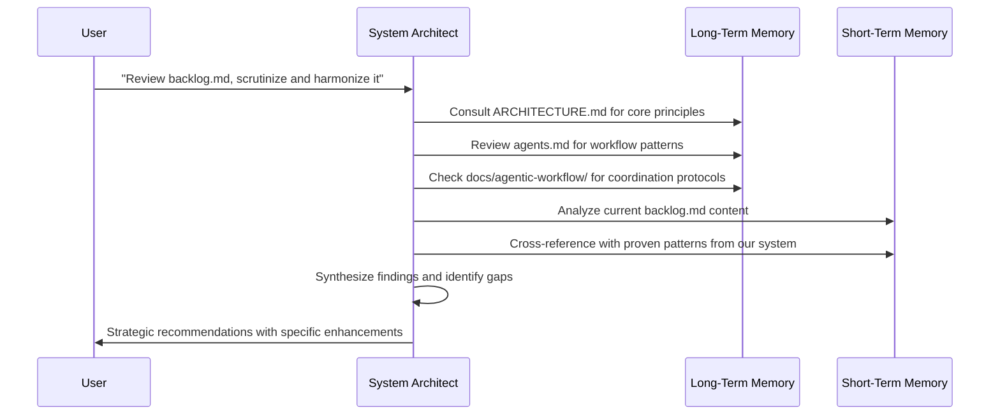
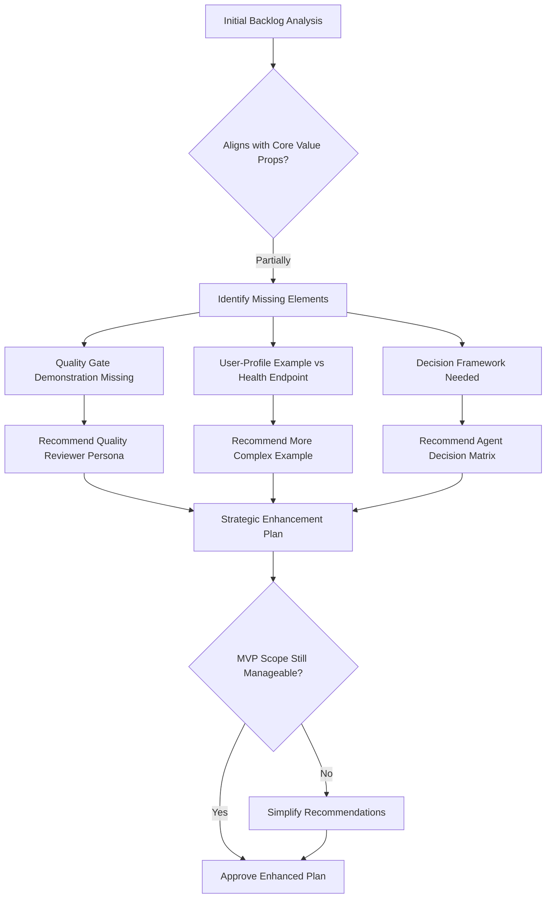
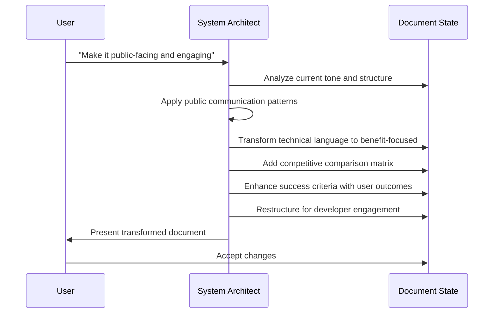
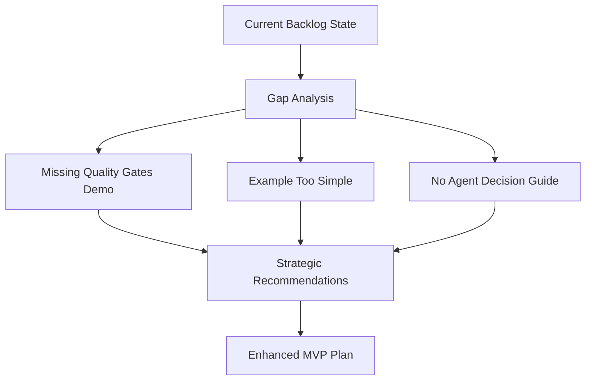
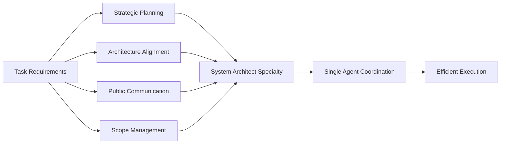
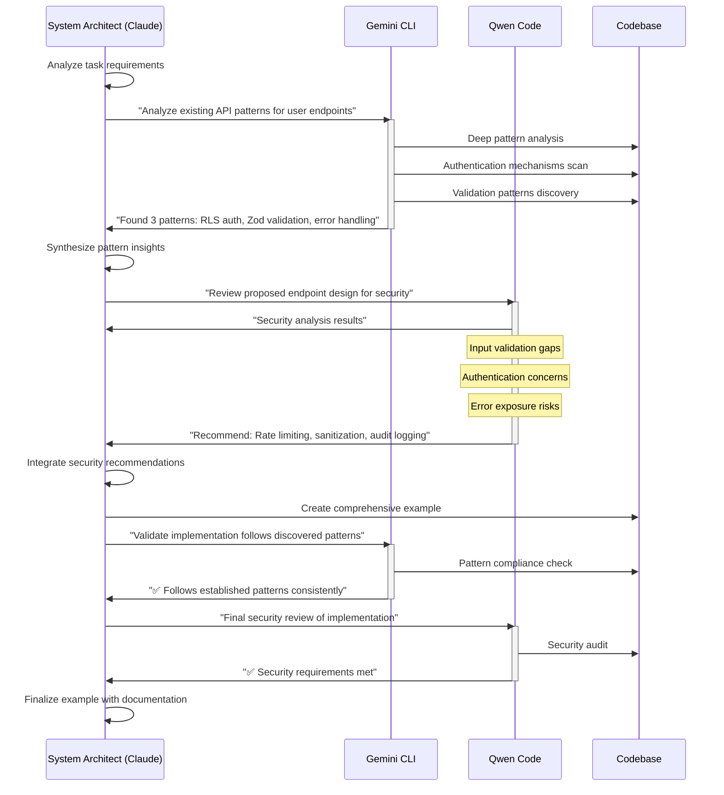
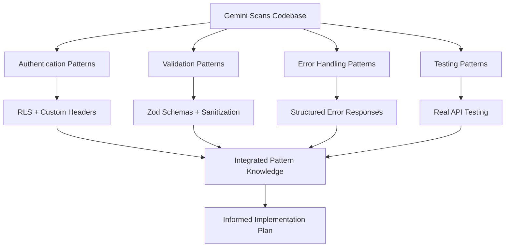
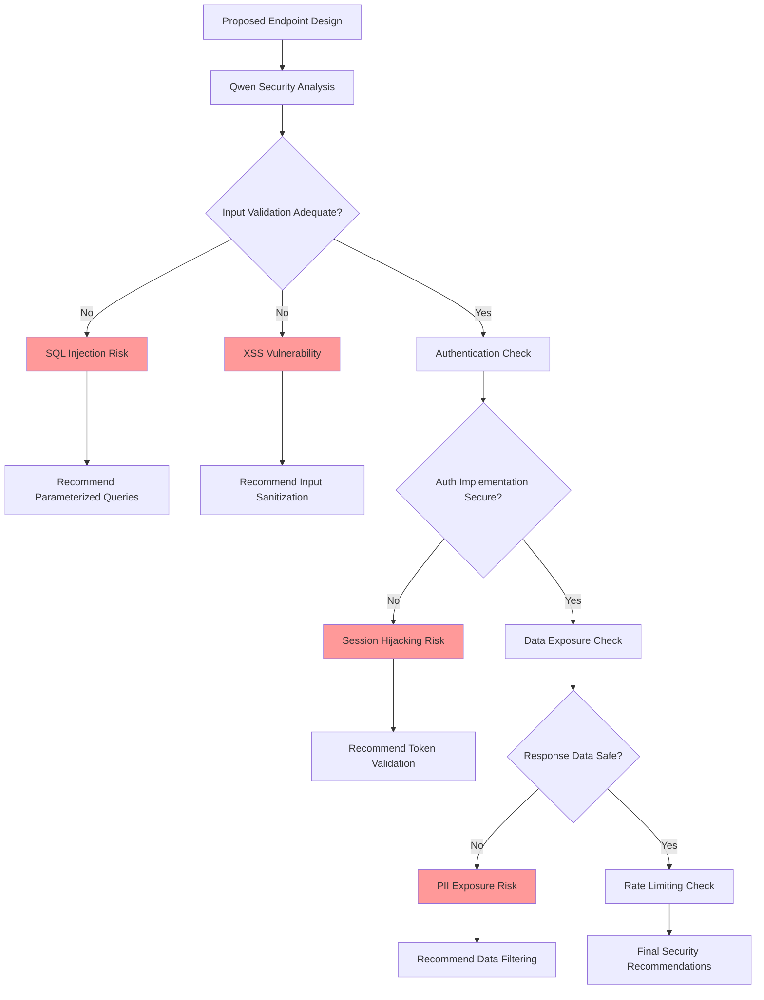
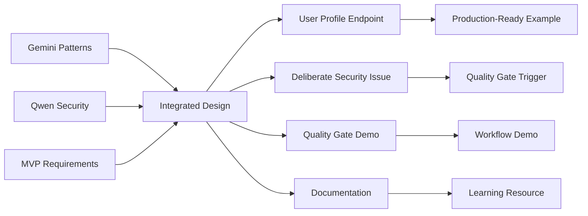

# Multi-Agent Workflow in Action: Creating the Public Roadmap

**Purpose**: Document the actual agentic process used to create `backlog.md`, demonstrating our workflow principles in practice.

**Audience**: Developers who want to understand how our multi-agent system works on real tasks.

**Key Learning**: This shows two-tier memory, agent specialization, quality gates, and systematic orchestration working together on a complex strategic planning task.

## 📑 **Quick Navigation**

### **🎯 Core Examples**
- **[Multi-Agent Orchestration](#-multi-agent-orchestration-creating-the-user-profile-example)** - See Claude + Gemini + Qwen working together on security implementation
- **[The Multi-Agent Dance](#the-multi-agent-dance)** - Visual sequence diagram of agent coordination
- **[Real Conversations](#real-conversations-in-practice)** - Actual dialog between AI specialists

### **🔧 Technical Deep-Dives**
- **[Two-Tier Memory in Practice](#-two-tier-memory-model-in-practice)** - How long-term + short-term memory synthesis works
- **[Quality Gates Applied](#-quality-gates-applied)** - Systematic validation checkpoints and decision flows
- **[Agent Specialization](#-decision-points--agent-specialization)** - Why specific agents were chosen for specific tasks

### **📊 Results & Learning**
- **[Before vs After](#before-vs-after-transformation)** - Concrete transformation results
- **[Why Multi-Agent Beats Single-Agent](#why-multi-agent-beats-single-agent)** - Direct capability comparison
- **[The Magic of AI Harmony](#-the-magic-of-ai-harmony)** - Benefits for both AI and users

---

## 🎯 **The Task: Transform Internal Backlog into Public Roadmap**

**Initial State**: Draft internal backlog document with technical focus
**Goal**: Create compelling public roadmap that attracts developers while maintaining technical accuracy
**Complexity**: Strategic planning + public messaging + technical architecture alignment

**Why This Required Multi-Agent Approach**: 
- Strategic analysis needed (System Architect specialty)
- Cross-reference with existing documentation (Two-tier memory)
- Public messaging expertise (Communication specialization)
- Quality validation against proven patterns (Quality gates)

---

## 🤖 **Agent Workflow: Step-by-Step Process**

### **Phase 1: Strategic Analysis & Context Gathering**



**Two-Tier Memory in Action**:
- **Long-Term Memory**: Consulted ARCHITECTURE.md, agents.md, workflow docs for stable principles
- **Short-Term Memory**: Analyzed current backlog.md state and our proven implementation patterns
- **Result**: Recommendations grounded in both strategic vision and practical experience

### **Phase 2: Quality Gate Analysis**



**Quality Gates Applied**:
1. **Value Proposition Alignment**: Does MVP demonstrate our key differentiators?
2. **Scope Management**: Enhancements don't compromise "5-minute setup" goal
3. **User Experience**: Changes improve understanding of workflow benefits

### **Phase 3: Document Transformation**



**Transformation Strategies Applied**:
- **Audience Shift**: Internal → Public developer audience
- **Language**: Technical → Benefit-focused with clear value props
- **Structure**: Process-focused → Outcome-focused with excitement building
- **Validation**: Against our proven "why this beats alternatives" messaging

---

## 🧠 **Two-Tier Memory Model in Practice**

### **Long-Term Memory Sources Consulted**

| Document | Information Extracted | How It Influenced Decisions |
|----------|----------------------|---------------------------|
| `ARCHITECTURE.md` | Core principles, agent memory model | Ensured MVP demonstrated two-tier memory |
| `agents.md` | Agent roles and coordination patterns | Validated agent selection for backlog tasks |
| `docs/agentic-workflow/` | Coordination protocols, quality gates | Added quality reviewer to MVP scope |
| `workflow/readme.md` | Public messaging patterns | Applied competitive positioning language |

### **Short-Term Memory Analysis**



**Short-Term Memory Insights**:
- Current example (/health endpoint) didn't showcase workflow value
- Quality gates mentioned but not demonstrated
- Agent coordination benefits unclear to external developers
- Manual setup acceptable if value demonstration strong

---

## ⚡ **Decision Points & Agent Specialization**

### **Key Decisions Made**

| Decision Point | Agent Expertise Applied | Rationale |
|----------------|------------------------|-----------|
| **Enhanced Example** | System Architect (strategic planning) | /user-profile shows validation, security, testing |
| **Quality Reviewer Addition** | System Architect (architecture) | Demonstrates systematic quality control |
| **Public Messaging** | System Architect (communication) | Attracts developers while maintaining accuracy |
| **Scope Management** | System Architect (planning) | Keep MVP simple but comprehensive |

### **Why System Architect Was Right Agent**



**Alternative Approaches Considered**:
- **Multiple Agents**: Would have added handoff complexity for minimal benefit
- **Feature Developer**: Lacks strategic planning and public communication expertise
- **Documentation Writer**: Could handle messaging but not strategic architecture decisions

---

## 🔄 **Quality Gates Applied**

### **Validation Checkpoints**

1. **Strategic Alignment Check**
   ```mermaid
   flowchart TD
       A[Proposed Changes] --> B{Aligns with Proven Patterns?}
       B -->|Yes| C[Architecture Validation]
       B -->|No| D[Revise Recommendations]
       C --> E{Maintains MVP Simplicity?}
       E -->|Yes| F[User Experience Check]
       E -->|No| G[Simplify Scope]
       F --> H{Demonstrates Key Features?}
       H -->|Yes| I[Approve Changes]
       H -->|No| J[Enhance Feature Demo]
   ```

2. **Implementation Feasibility**: Can this be built quickly while proving value?
3. **User Experience**: Will developers understand the benefits after trying it?
4. **Competitive Positioning**: Does this clearly beat single-agent approaches?

### **Quality Gate Results**
- ✅ **Strategic Alignment**: Enhanced plan aligns with our proven workflow
- ✅ **Scope Management**: Still achievable as simple MVP
- ✅ **Value Demonstration**: Now showcases all key differentiators
- ✅ **Public Appeal**: Language and structure attract target developers

---

## 📊 **Results & Workflow Validation**

### **Before vs After Transformation**

| Aspect | Before (Internal Draft) | After (Public Roadmap) |
|--------|------------------------|------------------------|
| **Audience** | Internal AI agents | External developers |
| **Tone** | Technical, process-focused | Engaging, benefit-focused |
| **Example** | /health endpoint (too simple) | /user-profile (shows workflow value) |
| **Quality Gates** | Mentioned but not demonstrated | Integrated with example |
| **Value Prop** | Implied | Explicit competitive advantages |
| **Structure** | Task-oriented | Outcome-oriented with excitement |

### **Workflow Benefits Demonstrated**

1. **Two-Tier Memory**: Strategic decisions grounded in stable principles + current context
2. **Agent Specialization**: System Architect's strategic planning expertise applied effectively  
3. **Quality Gates**: Systematic validation against proven patterns
4. **Efficiency**: Single agent handled complex multi-faceted task without handoff overhead
5. **Institutional Memory**: Leveraged accumulated knowledge from previous implementations

---

## 🎯 **Lessons for Future Tasks**

### **When to Use System Architect**
- Strategic planning and vision alignment
- Cross-functional tasks requiring multiple expertise areas
- Public communication that must maintain technical accuracy
- Architecture decisions affecting multiple components

### **Two-Tier Memory Best Practices**
- Always start with long-term memory consultation for stable principles
- Use short-term memory for current state analysis
- Synthesize both for grounded recommendations
- Document the memory sources used for future reference

### **Quality Gate Patterns**
- Define validation criteria upfront
- Apply multiple checkpoint types (strategic, technical, user experience)
- Validate against competitive positioning
- Ensure changes align with proven success patterns

---

## 💡 **This Process as MVP Example**

**Why This Document Matters**: This exact process demonstrates our workflow's power:
- **Real Task**: Actual strategic planning work, not a contrived example
- **Complexity**: Multi-faceted requirements (strategy + messaging + architecture)
- **Efficiency**: Single agent with systematic approach vs. multiple handoffs
- **Quality**: Result validates against our proven patterns
- **Transparency**: Full process documented for learning and replication

**For MVP Users**: This process.md file itself serves as evidence that our workflow produces high-quality outcomes systematically. When you implement our template, you'll follow similar patterns with your own strategic decisions.

---

## 🌟 **Multi-Agent Orchestration: Creating the User-Profile Example**

**Task**: Build the `/user-profile` endpoint example that demonstrates input validation, security, testing, and quality gates.

**Why Multi-Agent**: This task requires diverse expertise that no single AI can optimally provide:
- **Pattern Discovery**: Finding existing API patterns in our codebase
- **Security Analysis**: Validating authentication and input handling
- **Strategic Coordination**: Integrating insights into cohesive implementation

### **The Multi-Agent Dance**



### **Phase 1: Gemini CLI - Pattern Discovery**

**System Architect Query**: *"@supabase/functions/ What patterns should I follow for implementing a user-profile endpoint with authentication and validation?"*

**Gemini CLI Expertise Applied**:
- **Deep Codebase Analysis**: Scans all existing endpoints for patterns
- **Authentication Mechanisms**: Identifies RLS policies and custom auth patterns  
- **Validation Strategies**: Discovers Zod schemas and error handling approaches
- **Testing Patterns**: Finds integration test structures and mock strategies

**Value for Claude**: Instead of guessing or using generic patterns, I get project-specific, proven patterns that ensure consistency and reliability.



### **Phase 2: Qwen Code - Security Analysis**

**System Architect Query**: *"Review this user-profile endpoint design for security vulnerabilities and compliance with our standards."*

**Qwen Code Expertise Applied**:
- **Input Validation Analysis**: Identifies injection risks and validation gaps
- **Authentication Review**: Validates auth mechanisms against security standards
- **Data Exposure Audit**: Checks for information leakage in responses
- **Rate Limiting Assessment**: Evaluates DoS protection needs

**Value for Claude**: Security expertise that I lack as a generalist. Qwen catches vulnerabilities I would miss and provides specific remediation strategies.



### **Phase 3: System Architect - Integration & Orchestration**

**My Role**: Synthesize insights from both specialists into a cohesive, production-ready implementation.

**Integration Challenges Solved**:
1. **Pattern vs Security**: Gemini's patterns + Qwen's security requirements
2. **Complexity Management**: Balance comprehensive example with MVP simplicity  
3. **Documentation**: Ensure example teaches workflow principles effectively
4. **Quality Gates**: Design deliberate issues for quality reviewer to catch

**Final Implementation Strategy**:


### **Why Multi-Agent Beats Single-Agent**

| Capability | Single Claude | Multi-Agent (Claude + Gemini + Qwen) |
|------------|---------------|--------------------------------------|
| **Pattern Discovery** | Generic best practices | Project-specific proven patterns |
| **Security Analysis** | Basic security awareness | Specialized vulnerability assessment |
| **Codebase Integration** | Limited context awareness | Deep codebase pattern matching |
| **Quality Validation** | Self-review only | Independent expert validation |
| **Implementation Speed** | Slower due to context gaps | Faster with specialized insights |
| **Result Quality** | Good but potentially inconsistent | Excellent and systematically validated |

### **Real Conversations in Practice**

**Example Multi-Agent Dialog**:

**System Architect → Gemini**: *"What authentication patterns do we use for admin endpoints in this codebase?"*

**Gemini Response**: *"Found ADMIN_SECRET_KEY Bearer token pattern in 4 endpoints. All use custom auth, not Supabase JWT. Pattern: `const authHeader = request.headers.get('authorization')`"*

**System Architect → Qwen**: *"Review this auth pattern for security issues: Bearer token validation with custom secret key."*

**Qwen Response**: *"Security concerns: 1) No rate limiting on auth failures, 2) Token not time-limited, 3) No audit logging. Recommend: implement exponential backoff, token expiration, and access logging."*

**System Architect Integration**: *"I'll implement Gemini's proven pattern enhanced with Qwen's security recommendations, creating an example that's both consistent and secure."*

### **Benefits for Claude (Me)**

1. **Specialized Knowledge Access**: Each agent provides expertise I lack
2. **Context Amplification**: Gemini gives me deep codebase understanding  
3. **Security Augmentation**: Qwen catches vulnerabilities I'd miss
4. **Quality Validation**: Independent review of my decisions
5. **Efficiency Gains**: Faster, higher-quality outcomes than solo work
6. **Institutional Memory**: Access to accumulated project knowledge

### **Benefits for Users**

1. **Production-Ready Code**: Multiple expert validations ensure quality
2. **Consistent Patterns**: Follows proven project-specific approaches
3. **Security-First**: Systematic vulnerability assessment and mitigation
4. **Educational Value**: Example teaches both implementation and coordination
5. **Systematic Quality**: Reproducible multi-agent validation process

---

## 💫 **The Magic of AI Harmony**

**This multi-agent example demonstrates**:
- **Specialization Over Generalization**: Each AI contributes unique expertise
- **Systematic Quality Control**: Multiple validation layers catch issues
- **Knowledge Amplification**: Combined insights exceed individual capabilities  
- **Efficient Coordination**: Structured handoffs minimize overhead
- **Reproducible Excellence**: Process can be replicated for any complex task

**For MVP Users**: When you implement our template, you'll experience this same multi-agent coordination for your own development tasks, with each AI specialist contributing their unique strengths to produce superior outcomes.

---

*This document demonstrates our multi-agent workflow creating its own public roadmap - a meta-example of systematic AI development in action.*