# Multi-Agent AI Development Workflow
## Stop Fighting AI Technical Debt. Start Building Production-Ready Systems.

**Transform AI-assisted development from "smart autocomplete" into systematic engineering. This workflow produces AI-generated code that actually works in production.**

## 🎯 **What This Is**

A battle-tested **multi-agent workflow system** that orchestrates specialized AI agents to build production-grade software. Instead of relying on a single AI assistant that does everything poorly, this workflow deploys the right AI model for each specific task—like having a senior development team where each member excels at their specialty.

**Built for**: Development teams who need AI-generated code that actually works in production, not just demos.

### **📖 Documentation Navigation**
- **This README**: Overview, benefits, and competitive comparison
- **[process.md](./process.md)**: See the workflow in action with real examples and multi-agent coordination  
- **[backlog.md](./backlog.md)**: Public roadmap with MVP plans and future development phases

---

## 🏆 **When This Workflow Crushes the Competition**

### **✅ Perfect For:**
- **Production Applications**: Where reliability matters more than prototype speed
- **Complex Systems**: Multi-component architectures with intricate dependencies  
- **Security-Critical Projects**: Handling user data or requiring compliance
- **Long-term Codebases**: Projects that must remain maintainable over months/years
- **Team Development**: Multiple contributors (human or AI) working on the same codebase

### **❌ Overkill For:**
- Quick prototypes or throwaway code
- Single-file scripts or simple utilities
- Projects with no quality requirements
- Solo experiments or learning exercises

---

## ⚡ **How We Outperform Alternatives**

| Challenge | Vanilla Cursor/Cline | Single Claude/Gemini | **Our Multi-Agent System** |
|-----------|---------------------|---------------------|---------------------------|
| **Code Quality** | Inconsistent patterns, no oversight | Good but no systematic validation | Mandatory quality gates with specialized reviewers |
| **Security** | Ad-hoc security considerations | Generalist security knowledge | Dedicated security specialist (Qwen Code) for all critical paths |
| **Complex Systems** | User must orchestrate everything | Single agent gets overwhelmed | System Architect coordinates, specialists execute |
| **Documentation** | Becomes stale quickly | Generic documentation | Code-first strategy with automated validation |
| **Production Reliability** | No systematic testing approach | May use mocks/shortcuts | Real API testing mandate—no mocking allowed |
| **Architectural Consistency** | Relies entirely on user vigilance | No institutional memory | Formal architectural patterns with enforcement |

---

## 🔧 **Core Philosophy: Engineering Over Hacking**

This system transforms AI development using four core principles:

### **1. Best-of-Breed Specialization**
Each AI model handles what it does best:
- **System Architect (Claude)**: Strategic planning and coordination
- **Security Reviewer (Qwen Code)**: Security analysis and architecture validation  
- **Context Specialist (Gemini CLI)**: Deep codebase analysis and pattern discovery
- **Feature Developer (Claude)**: Implementation and testing
- **Documentation Writer (Claude)**: Knowledge transfer and maintenance

### **2. Formal Cognitive Architecture**
**Long-Term Memory**: Stable architectural principles in documentation  
**Short-Term Memory**: Live codebase accessed through structured analysis  
**Result**: AI agents reason like senior engineers, validating every change against established principles

### **3. Non-Negotiable Quality Guardrails**
- **Real API Testing**: No mocking allowed—ensures production readiness
- **Security-First**: Mandatory reviews for all critical changes
- **Architectural Patterns**: Enforced consistency across the entire codebase
- **Code-First Documentation**: Documentation that evolves with implementation

### **4. Systematic Orchestration**
Explicit handoff protocols, dependency management, and quality gates ensure nothing falls through the cracks.

## 🤖 **How the Multi-Agent Team Works**

Think of it like a senior development team where each member has a specialized role:

### **Agent Specialization Matrix**

| Specialist | Primary Responsibility | When They're Critical |
|------------|----------------------|---------------------|
| **System Architect** | Strategic planning, task coordination | Complex features, architectural decisions |
| **Security Reviewer** | Code quality, security validation | All production code, critical systems |
| **Context Specialist** | Codebase analysis, pattern discovery | Large refactors, complex integrations |
| **Feature Developer** | Implementation, testing | All development work |
| **Documentation Writer** | Knowledge transfer, maintenance | Feature completion, architectural changes |

### **👀 See It in Action**
Want to see how this multi-agent coordination works on real tasks? Check out **[process.md](./process.md)** for detailed examples including:
- **Complete workflow walkthrough**: How we created our public roadmap using systematic multi-agent coordination
- **Multi-agent orchestration**: Claude + Gemini CLI + Qwen Code working together on complex security implementation
- **Two-tier memory in practice**: Real examples of long-term + short-term memory synthesis
- **Quality gates demonstration**: Actual validation checkpoints and decision flows

---

## 🔄 **The Secret: Systematic Quality Control**

Unlike traditional AI coding where quality is hit-or-miss, our workflow enforces systematic quality through:

### **Mandatory Quality Gates**

```mermaid
flowchart TD
    A[Code Complete] --> B{Security Critical?}
    B -->|Yes| C[🔒 Security Review Required]
    B -->|No| D[📋 Standard Testing]
    C --> E[🧪 Real API Testing]
    D --> E
    E --> F{All Gates Pass?}
    F -->|No| G[🔄 Return for Fixes]
    F -->|Yes| H[✅ Production Ready]
    G --> A
```

### **Proven Architectural Patterns**
- **Real API Testing**: No mocking—if it doesn't work with real APIs, it doesn't ship
- **Security-First**: Every critical path reviewed by specialized security agent
- **Code-First Documentation**: Documentation automatically validated against actual implementation
- **Semantic Landmarks**: Documentation that can't become outdated because it's tied to searchable code patterns

---

## 💡 **Why Traditional AI Coding Fails (And How We Fix It)**

### **The Problem with Single-Agent Development:**

**❌ Context Overload**: One agent trying to handle planning, implementation, security, and documentation  
**❌ No Quality Control**: No systematic validation of AI-generated code  
**❌ Architectural Drift**: Each session starts fresh with no institutional memory  
**❌ Security Blind Spots**: Generalist agents miss security implications  
**❌ Documentation Rot**: Documentation becomes stale and misleading  

### **Our Multi-Agent Solution:**

**✅ Specialized Expertise**: Right AI model for each specific task  
**✅ Built-in Quality Gates**: Systematic validation at every step  
**✅ Institutional Memory**: Formal architectural principles preserved across sessions  
**✅ Security-First**: Dedicated security specialist reviews all critical paths  
**✅ Living Documentation**: Code-first approach ensures documentation stays current  

---

## 🎯 **Ready to Get Started?**

This workflow is perfect for teams who:
- ✅ Build production applications (not just prototypes)
- ✅ Need consistent code quality across AI-generated code
- ✅ Work on complex systems with multiple components
- ✅ Require security compliance or handle sensitive data
- ✅ Want AI assistance that enhances rather than replaces engineering discipline

### **📋 Our Implementation Plan**
See our complete **[Public Roadmap](./backlog.md)** for detailed implementation strategy:
- **🎯 MVP**: 5-minute manual setup with full workflow demonstration
- **⚡ Phase 2**: Automated CLI tools and validation scripts  
- **🚀 Phase 3**: Community plugins and enterprise migration tools

**Next Up**: Template repository with agent personas, quality gate examples, and step-by-step tutorials.

---