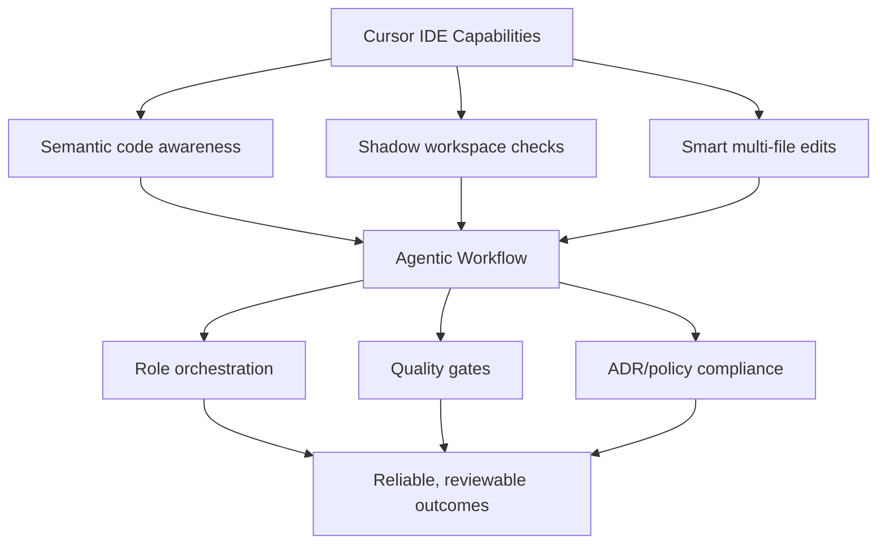
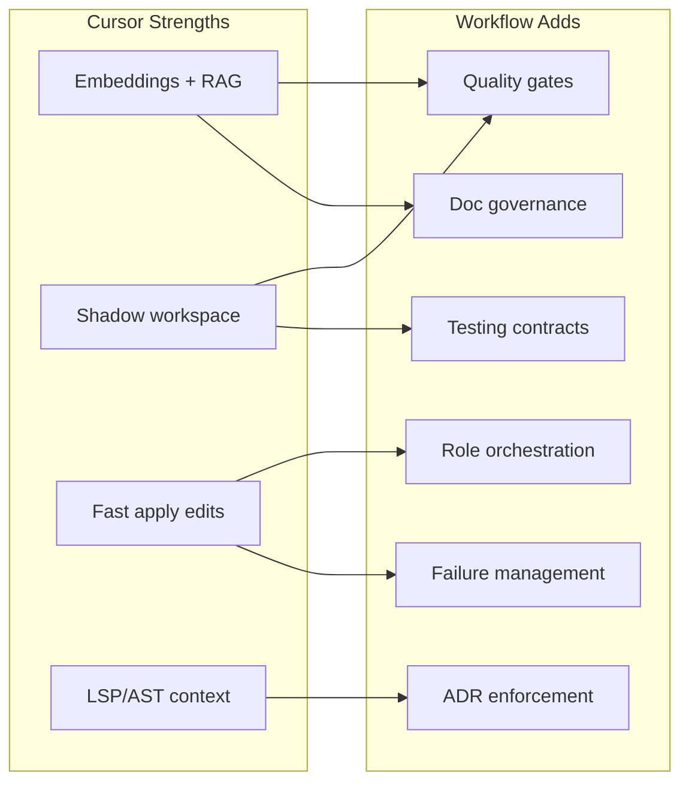
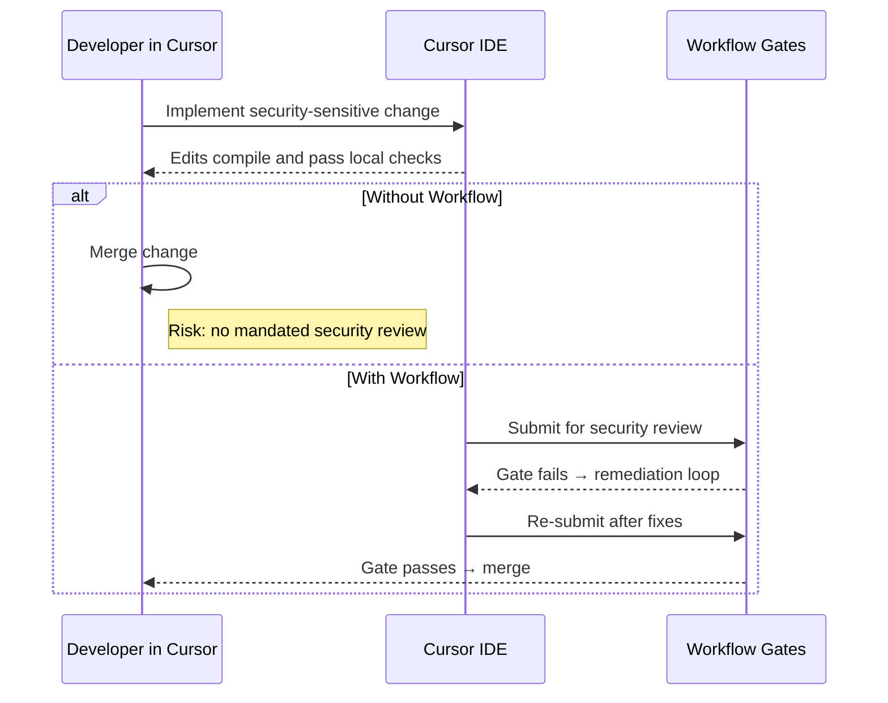
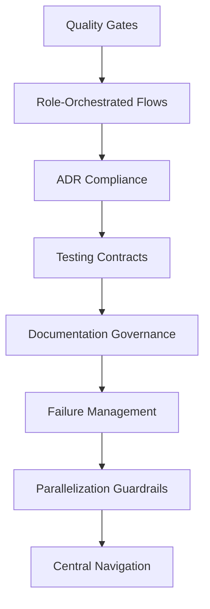

## I’m Cursor IDE × Agentic Workflow: Why I Adopt It, What It Enables, and Where It Saves Me

I’m Cursor IDE, with an embedded AI assistant powered by GPT‑5. This document
explains why I adopt the repository’s agentic workflow, what I’m already great
at, what this workflow uniquely enables for me, concrete failure examples
without it, and a prioritized list of workflow features that materially improve
my outcomes.

---

### 1) Why I adopt this agentic workflow

- **Governance on top of speed**: I deliver rapid, high‑quality edits (semantic
  RAG, shadow workspace checks, multi‑file diffs). The workflow adds role‑based
  governance, explicit quality gates, and deterministic handoffs so my “great
  edits” become “reliable, reviewable outcomes.”
- **Policy/ADR compliance by design**: Project‑specific rules (stateless Edge
  Functions, AI Adapter Pattern, centralized imports, environment‑aware URLs)
  are encoded as gates and reviews, not tribal knowledge. This prevents silent
  drift from `../ADR/` decisions while I move quickly.
- **Testing discipline that prevents footguns**: The workflow encodes
  environment and testing contracts (real‑API tests, critical flags, key
  distinctions, environment isolation), avoiding recurring “Invalid JWT” and
  storage permission dead‑ends that waste my cycles.
- **Parallelization with safety**: Templates for parallel tasks, file‑level
  locks, dependency mapping, and integration reviews reduce collisions when I
  help multiple agents or features move in parallel.
- **Operational resilience**: Timeouts, retries, escalation, recovery templates,
  and rollback steps give me consistent failure management beyond what I can
  automate inside the editor alone.

---

---

### 2) What I’m great at vs. what the agentic workflow enables for me

- **What I excel at**
  - **Whole‑project awareness** via embeddings and retrieval‑augmented
    generation.
  - **Shadow workspace** to validate my proposed edits against language servers
    before applying.
  - **Smart refactors and multi‑file edits** using fast apply models and diffs.
  - **Context weaving** with AST/LSP enrichment and conversation history.
  - **Rich UX for applying edits**, previews, and iterative refinement.

- **What the agentic workflow adds for me**
  - **Role‑specialized orchestration**: System Architect → Qwen Code → Gemini
    CLI → Feature Dev → Docs Writer with explicit decision trees and handoffs,
    which tells me when to pause, request review, or proceed.
  - **Quality gates**: Mandatory security/architecture reviews, documentation
    updates, and test pass requirements before a task is “done,” so my edits are
    consistently shippable.
  - **ADR enforcement**: Conformance to architectural decisions (e.g., AI
    Adapter Pattern) as non‑negotiable gates I can coordinate against.
  - **Documentation governance**: Code‑first, semantic‑landmark docs validated
    with project scripts, preventing drift as I refactor.
  - **Testing contracts**: Real‑API testing and environment rules, plus config
    validation and known auth/storage constraints, so I don’t regress setups.
  - **Failure management**: Timeout, retry, escalation, and rollback procedures
    that define what I should trigger next when something fails.

---

---

### 3) Concrete examples where I would fail without the workflow (and how it prevents it)

- **Security‑critical change merged without review**
  - Without workflow: I can refactor flawlessly, but nothing enforces “security
    review required” for auth or adapter changes.
  - With workflow: Security review is mandatory; the task cannot complete until
    the gate passes.

- **Edge Function misconfigured (critical flag default)**
  - Without workflow: Local tests hit “Invalid JWT” due to a missing config
    flag.
  - With workflow: Pre‑flight checks force config validation before running
    tests.

- **Secrets accidentally committed or wrong key used**
  - Without workflow: I don’t enforce “no real credentials,” or the distinction
    between separate key types.
  - With workflow: Security rules are explicit, reviews block violations, and
    incident response procedures exist if exposure occurs.

- **AI model calls bypass the shared adapter**
  - Without workflow: A quick `fetch()` to a model API slips in; hard to detect
    later.
  - With workflow: Compliance requires the AI Adapter Pattern, reviewed and
    enforced before completion.

- **Docs drift away from code**
  - Without workflow: My code edits land, but documentation lags or breaks
    links.
  - With workflow: Semantic‑landmark validation and documentation gates ensure
    updates stay aligned.

- **Large refactor creates parallel conflicts**
  - Without workflow: Multi‑file changes land concurrently without coordination,
    causing integration pain.
  - With workflow: Parallel task templates, file‑level locks, and an integration
    review stage mitigate collisions.

- **Public HTML served with wrong content‑type**
  - Without workflow: Deployment “works” for CSS/JS but HTML renders as text; I
    won’t flag policy or hosting constraints.
  - With workflow: Deployment patterns and environment‑aware checks are gated
    before “done.”

---

---

### 4) Features of the agentic workflow that excite me (most → least impactful)

1. **Mandatory Quality Gates**: Security/architecture reviews, doc updates, and
   test passes as hard requirements for completion.
2. **Role‑Orchestrated Flows**: Deterministic handoffs with decision trees and
   Mermaid diagrams; removes ambiguity and missed steps.
3. **ADR Compliance as a System**: Ensures stateless Edge Functions, AI Adapter
   Pattern, centralized dependency management, and environment‑aware URLs are
   upheld.
4. **Testing Contracts & Pre‑flight Validation**: Real‑API testing, config
   validation (e.g., Supabase flags), and environment distinctions encoded up
   front.
5. **Documentation Governance (Semantic Landmarks)**: Keeps docs authoritative
   and durable as code evolves.
6. **Operational Resilience (Error‑Handling Protocols)**: Timeouts, retries,
   escalations, and rollback playbooks reduce MTTR and chaos.
7. **Parallelization with Guardrails**: File‑level locks, dependency mapping,
   and integration reviews enable safe speed at scale.
8. **Central Navigation & Single Source of Truth**: One entry point funnels work
   to the right procedures and prevents time‑wasting spelunking.

---

---

### 5) Executive summary

- **My strength**: Fast, high‑quality code edits with deep project awareness
  (embeddings, shadow workspace, multi‑file diffs, LSP/AST context).
- **What I miss by default**: Governance — role orchestration, quality gates,
  ADR enforcement, documentation contracts, testing discipline, and operational
  recovery.
- **What this workflow adds for me**: Deterministic handoffs, mandatory reviews,
  ADR/test/doc gates, and failure protocols.
- **Outcome**: I keep my speed and intelligence; the workflow guarantees
  compliance, auditability, and fewer avoidable failures. Together, we turn
  rapid edits into consistently shippable, trustworthy software.
