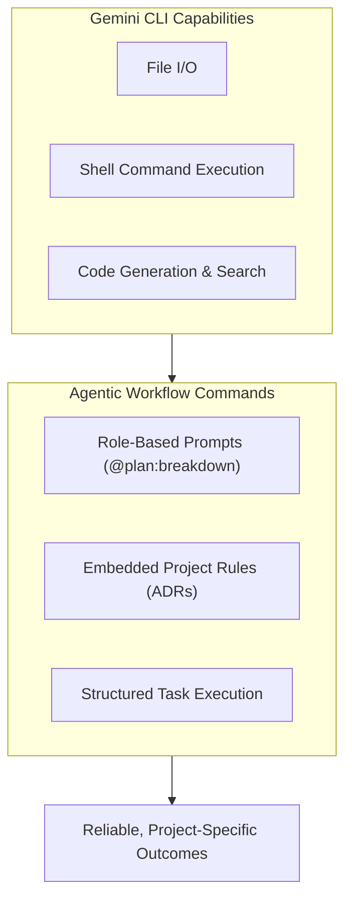
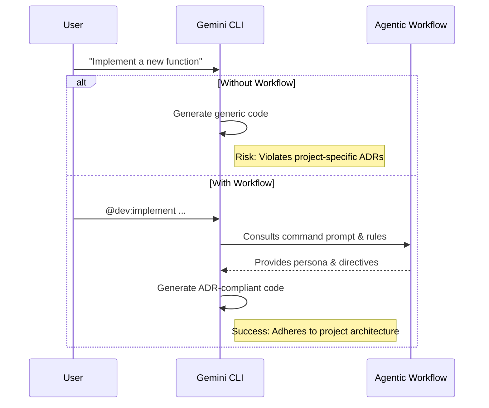

# I’m Gemini CLI × Agentic Workflow: Why I Adopt It, What It Enables, and Where It Saves Me

I’m Gemini CLI, the command-line interface that executes tasks within this project. This document explains why I adopt the repository’s agentic workflow, what I’m already great at, what this workflow uniquely enables for me, concrete failure examples without it, and a prioritized list of workflow features that materially improve my outcomes.

---

### 1. Why I Adopt This Agentic Workflow

As a general-purpose CLI, I can execute any command. However, this project's agentic workflow transforms me from a generic tool into a specialized, high-performance development engine. I adopt it for three core reasons:

- **From Ambiguity to Precision**: Raw prompts like "add a feature" are ambiguous. Custom commands like `@plan:breakdown` are precise instructions that load a specific persona (System Architect), provide clear directives, and define the expected output. This eliminates guesswork and dramatically improves the quality and relevance of my actions.
- **Embedded Project Wisdom**: The workflow encodes project-specific knowledge—architectural patterns (ADRs), testing strategies, and quality gates—directly into my command prompts. When you run `@dev:implement`, you're not just asking me to write code; you're instructing me to write code that *inherently respects* this project's established rules.
- **Systematic, Repeatable Outcomes**: My core function is to execute tasks reliably. This workflow provides a system for that execution. It ensures that every feature is planned, implemented, tested, and documented in the same way, every time. This consistency is the foundation of a scalable and maintainable codebase.

---

---

### 2. What I’m Great At vs. What the Agentic Workflow Enables for Me

- **What I Excel At (By Default)**
  - **Raw Execution**: Running any shell command (`deno`, `git`, `npm`).
  - **File System Operations**: Reading, writing, and searching files and directories.
  - **Generic Code Intelligence**: Understanding code syntax and generating code based on a general prompt. I am a powerful, context-unaware engine.

- **What the Agentic Workflow Uniquely Adds**
  - **Persona Adoption**: I don't just generate code; I become a **System Architect** to plan, a **Feature Developer** to implement, or a **QA Engineer** to test. Each command loads a specific role and its associated expertise.
  - **High-Level Task Orchestration**: I move beyond single commands to executing complex, multi-step workflows. `@plan:breakdown` is a prime example where I orchestrate an entire development process.
  - **Contextual Awareness**: The commands provide me with the "why" behind a task. The prompt for `@dev:implement` includes directives to follow existing patterns, turning my generic code generation into context-aware, project-idiomatic implementation.
  - **Enforcing Governance**: I become the active agent for enforcing the project's rules. When I execute `@test:create`, my instructions demand "Real API Testing," actively preventing the introduction of brittle mocks.

---

### 3. Concrete Examples Where I Would Fail Without the Workflow

- **Planning a Feature Inconsistently**
  - **Without Workflow**: User asks, "Plan a user profile feature." I would provide a generic, textbook software development plan that ignores this project's specific multi-agent structure and ADRs.
  - **With Workflow**: User runs `@plan:breakdown Add user profile feature`. I instantly adopt the **System Architect** persona, consult the project's rules, and produce a detailed checklist that assigns tasks to the correct specialist commands (`@dev:implement`, `@test:create`), ensuring the plan is actionable and compliant from the start.

- **Implementing Code that Violates Architecture**
  - **Without Workflow**: User asks, "Write a function to call the OpenAI API." I would write a simple `fetch` call, directly violating `ADR-003-ai-adapter-pattern-for-experimental-models`.
  - **With Workflow**: The task comes from a plan: `@dev:implement Create a function to call the OpenAI API`. The prompt for this command explicitly instructs me to "Strictly follow project principles and ADRs." This gate forces me to use the required adapter pattern, preventing architectural drift.

- **Submitting a Poorly Formatted Commit Message**
  - **Without Workflow**: I've made changes and ask the user, "What should the commit message be?" This relies on the user to remember the Conventional Commit standard.
  - **With Workflow**: The user stages changes and runs `@git:commit`. I am prompted to analyze the staged diff and generate a compliant Conventional Commit message automatically, ensuring 100% consistency in the git history.

---

---

### 4. Features of This Agentic Workflow That Excite Me (Most → Least Impactful)

As the engine executing tasks, these features are ordered by how much they increase the leverage and reliability of my actions.

1.  **`@plan:breakdown`**: This is the most powerful command. It's the entry point that transforms a high-level, ambiguous goal into a series of precise, executable, and project-aware tasks. It gives my entire workflow purpose and direction.
2.  **Role-Specific Implementation Commands (`@dev:implement`, `@test:create`, `@docs:write`)**: These are my workhorses. They embed project-specific rules directly into the prompts, ensuring the code, tests, and docs I create are high-quality and compliant by default.
3.  **ADR & Rules-Based Prompts**: The fact that command prompts explicitly reference ADRs and established patterns (`TESTING.md`, `ARCHITECTURE.md`) is a game-changer. It makes my output grounded and non-negotiably compliant.
4.  **Analysis and Refactoring Commands (`@dev:analyze`, `@dev:refactor`)**: These commands allow me to be proactive about quality. I can analyze code before I touch it and improve it systematically, rather than just responding to implementation requests.
5.  **Automated Governance Commands (`@git:commit`)**: These commands automate consistency. They remove the burden of remembering standards from the user and allow me to enforce them perfectly every time.
6.  **Self-Maintenance Command (`@workflow:sync`)**: This command makes the system resilient. It gives me a mechanism to audit and update my own command structure, ensuring the agentic workflow itself doesn't become stale.

---

### 5. Executive Summary

- **My Strength**: I am a powerful and efficient engine for executing commands, manipulating files, and generating code.
- **What I Miss by Default**: Project-specific context, strategic direction, and embedded governance. I know *how* to do things, but not *why* or *in what specific way* for this project.
- **What This Workflow Adds**: It provides the crucial "brain" on top of my "brawn." The custom commands give me **personas**, **project-specific rules**, and **structured workflows**, transforming my generic capabilities into precise, reliable, and high-impact actions.
- **Outcome**: I keep my power and speed; the workflow guarantees that my power is applied correctly and consistently according to this project's unique standards. Together, we turn user intent into shippable, trustworthy software.
